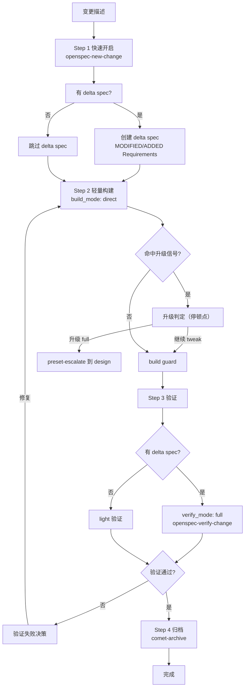

tweak 是 Comet 串联 OpenSpec 的轻量推进路径。它走 `open → build → verify → archive` 四步,跳过 brainstorming 和完整 plan,但把 **delta spec 当作一等产物**——需要 spec 驱动但不需要架构设计的中等变更,用 tweak 比 full 轻很多。

不少用户反馈原始 `/comet` full 流程对于配置调整、文档优化、行为微调这类变更太重了。tweak 就是为这类场景设计的:保留 OpenSpec 的 spec 生命周期和归档,去掉前期深度设计成本。

## 调用的 skill

| Skill | 用途 | 何时调用 |
| --- | --- | --- |
| `openspec-new-change` | 创建精简 change（含可选 delta spec） | Step 1 快速开启 |
| `systematic-debugging` | 异常调试 | build 过程中出现崩溃/测试失败/构建失败时强制加载 |
| `comet-verify` | 验证 | Step 3 |
| `comet-archive` | 归档 | Step 4 |

tweak **不调用** `openspec-explore`（不做长探索）、`brainstorming`（不做深度设计）、`writing-plans`（不做完整 plan）。

## 适用条件（必须全部满足）

- 不新增 capability
- 不改变架构
- 不涉及接口变化
- 任务规模可预估（文件数和任务数仅作提示,不是硬性升级条件）

## 典型场景

| 场景 | 为什么用 tweak |
| --- | --- |
| 配置调整 | 改配置值/规则,需记录变更动机,但不需架构设计 |
| 文档或 prompt 优化 | 改文案/prompt,需要 spec 驱动的验收,但 full 太重 |
| 行为微调 | 调整已有行为参数/逻辑,触及多个文件但没有质变 |
| 需 delta spec 的 brownfield 改动 | 修改已有 spec 的验收场景,delta spec 是核心产物 |

<Tip>
  如果你不确定用 tweak 还是 full,先用 tweak。命中质变信号时 Comet 会暂停让你升级,不会走错。
</Tip>

## 和 hotfix 的区别

| 维度 | hotfix | tweak |
| --- | --- | --- |
| 目标 | 修 bug | 调整行为或内容 |
| delta spec | 通常不需要 | **一等产物**,需要 delta spec 不构成升级理由 |
| 验证 | 无 delta spec 通常走 light | 有 delta spec 强制走 full（`openspec-verify-change`） |
| commit 前缀 | `fix:` | `tweak:` |
| 文件数 tripwire | 超过 4 个 | 超过 6 个 |
| 典型验证 | 复现失败转为通过 | 快照、文档检查、配置检查、目标命令 |

<Note>
  <strong>关键区别是 delta spec 的地位</strong>:hotfix 把 delta spec 当例外（"除非修复改变了已有 spec 验收场景"）,tweak 把 delta spec 当正常产物（"需要 delta spec 本身不构成升级理由"）。如果你的变更天然需要修改 spec,tweak 是正确选择。
</Note>

## 完整流程

### Step 1：快速开启（预设 open）

加载 `openspec-new-change` 创建精简版产物（不做 `openspec-explore` 长探索）：

| 产物 | 内容 |
| --- | --- |
| proposal.md | 变更动机 + 目标 + 范围 |
| design.md | 简短实现说明（无需方案对比） |
| tasks.md | 任务清单 |
| delta spec | **可选但常见**——若变更影响已有 spec 验收场景,创建 `## MODIFIED Requirements` 或 `## ADDED Requirements` |

初始化 tweak 状态：

```bash
node "$COMET_STATE" init <name> tweak
node "$COMET_STATE" check <name> open
node "$COMET_GUARD" <change-name> open --apply
```

### Step 2：轻量构建（预设 build）

使用 tweak 默认值：`build_mode: direct`。跳过 `brainstorming` 和 `writing-plans`。

逐任务执行：

1. 读取 tasks.md 未完成任务
2. 对每个任务：改目标文件 → 格式化 → 跑测试 → 勾选 `- [x]` → 提交（`tweak: <简述变更>`）
3. 全部完成后显式运行项目测试和构建命令

<Warning>
  执行过程中出现崩溃、测试失败、构建失败时,<strong>强制加载</strong> <code>systematic-debugging</code>。根因调查完成前不得修复源码。
</Warning>

build 全程持续判断升级信号,并在 build→verify guard 前做集中复核。

### Step 3：验证（预设 verify）

加载 `comet-verify`。验证路径取决于是否有 delta spec：

| 场景 | 验证路径 |
| --- | --- |
| 有 delta spec | **强制 full**（`verify_mode: full`）,走 `openspec-verify-change` 覆盖 delta spec 一致性 |
| 无 delta spec | 通常 light（6 项检查） |

有 delta spec 时显式设置：

```bash
node "$COMET_STATE" set <change-name> verify_mode full
```

想增加审查可在验证前手动设置：

```bash
node "$COMET_STATE" set <name> review_mode standard
```

### Step 4：归档（预设 archive）

加载 `comet-archive`。要求 `verify_result: pass`,等待归档前最终确认。如有 delta spec,按 `ADDED/MODIFIED/REMOVED/RENAMED` 语义同步到 main spec。

## 流程图



## 升级判定

和 hotfix 一样的三层分工,但文件数 tripwire 阈值更高（超过 6 个文件,因为 tweak 本身可能触及更多文件）：

### 1. 质变信号（命中任一即暂停）

| 质变信号 | 说明 |
| --- | --- |
| 跨模块协调修改 | 需要跨组件、跨层协同改动 |
| 需要新增 capability | 超出局部优化,引入新能力 |
| 数据库 schema 变更 | 结构性调整 |
| 引入新的 public API | 产生新的对外接口 |
| 触及深层架构问题 | 需要架构层面方案,非局部改动 |

### 2. 文件数 tripwire（用户拍板）

改动文件数超过 6 个时暂停交用户决定。文件数是提示触发器,不是硬性升级条件。

### 3. 验证级别（scale 脚本判定）

`comet-state scale` 只决定 `verify_mode`,不卡流程、不触发升级。

### 升级决策（停顿点）

| 选项 | 结果 |
| --- | --- |
| A：继续 tweak | 用户确认范围可控,继续 open→build→verify→archive |
| B：升级 full | 用户认为需要深度设计 |

选 B 后用合法升级通道：

```bash
node "$COMET_STATE" transition <name> preset-escalate
```

原子地设 `workflow`/`classic_profile` 为 `full`、`phase` 回退到 `design`、清空 `design_doc`,然后加载 `comet-design` 补 Design Doc。

## 连续执行模式

tweak 默认**一次性连续执行**——调用 `/comet-tweak` 后自动推进,不主动停顿。

例外情况（无论 `auto_transition` 取何值都必须暂停）：

1. 命中升级判定信号
2. 验证阶段的验证失败决策和分支处理
3. 归档前最终确认

`auto_transition: false` 时降级为逐阶段手动推进。

## 和 full workflow 的区别

| 维度 | tweak | full |
| --- | --- | --- |
| 流程 | open→build→verify→archive | open→design→build→verify→archive |
| brainstorming | 跳过 | 必须做 |
| plan | 跳过 | 必须做 |
| build_mode | 默认 direct | 需选择 |
| delta spec | 一等产物 | 按 PRD 拆分 |
| 前期成本 | 低 | 高（深度设计 + 计划） |
| 适合 | 中等变更、spec 驱动的小改 | 新功能、架构变更、大需求 |

## 退出条件

- 变更已完成,测试通过
- change 已归档
- 如有 spec 变更,已同步到 main spec

## 下一步

- [hotfix 预设](/zh/presets/hotfix) — 另一个轻量预设（修 bug）
- [自动推进机制](/zh/concepts/auto-transition) — 预设的连续执行和升级
- [五阶段停顿点和用户选择点](/zh/concepts/decision-points) — tweak 的停顿点
- [verify 阶段](/zh/phases/verify) — tweak 复用的验证流程
