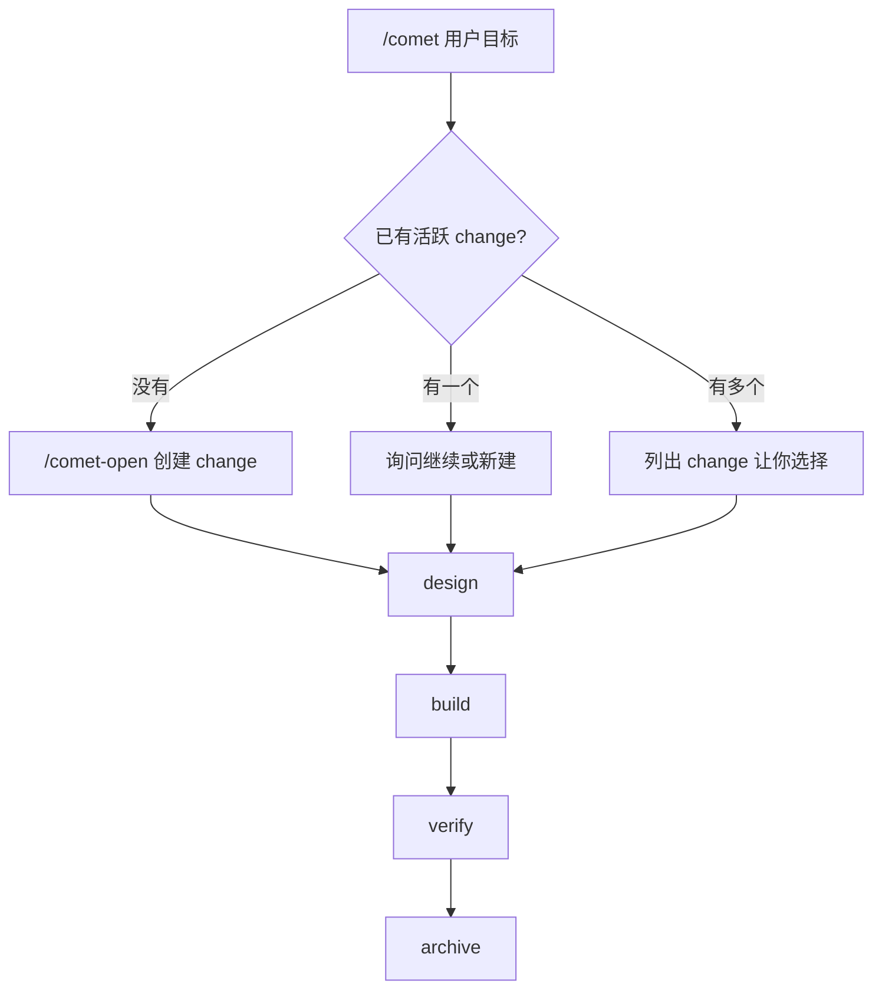

本页带你完成最短路径：安装 CLI、初始化项目、在 Agent 平台里调用 `/comet`。

## 前置要求

- Node.js 20 或更高版本
- npm 或 npx
- Git
- 一个受支持的 AI 编码平台，例如 Claude Code、Codex、Cursor、Gemini CLI、OpenCode 或 ZCode

## 1. 安装 CLI

```bash
npm install -g @rpamis/comet
```

检查命令是否可用：

```bash
comet --version
```

## 2. 初始化项目

进入你的项目根目录：

```bash
cd your-project
comet init
```

交互式向导会让你选择：

- 安装范围：项目级或全局。
- Skill 语言：中文或 English。
- 目标平台：Comet 会自动检测已有配置。
- 可选依赖：OpenSpec、Superpowers、CodeGraph。

<Info>
  项目级安装更适合团队协作。全局安装更适合个人跨项目使用。
</Info>

## 3. 调用 `/comet`

打开你的 Agent 平台，在项目里输入：

```text
/comet 实现用户资料页的头像上传能力
```

Comet 会自动判断当前是否已有活跃 change。如果没有，它会进入 open 阶段，创建 OpenSpec proposal、design、tasks 和 `.comet.yaml` 状态文件。



## 4. 查看状态

任何时候都可以运行：

```bash
comet status
```

你会看到活跃 change、当前阶段、下一步命令和诊断提示。状态异常时再运行：

```bash
comet doctor
```

## 5. 继续中断的工作

如果会话中断，重新打开项目后输入：

```text
/comet
```

Comet 会重新读取 OpenSpec、`.comet.yaml` 和运行证据，从当前阶段继续。

## 下一步

- 想理解五阶段流程：读 [工作流概念](/zh/concepts/workflow)。
- 想设置项目默认行为：读 [状态与配置](/zh/concepts/state-management)。
- 想做快速修复：读 [hotfix 预设](/zh/presets/hotfix)。
