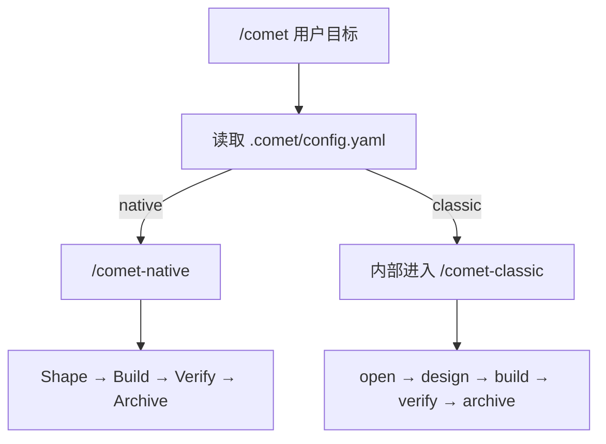

本页带你完成最短路径：安装 CLI、以默认 Native 初始化项目、在 Agent 平台里调用 `/comet`。

## 前置要求

- Node.js 22 或更高版本
- npm 或 npx
- Git
- 一个受支持的 AI 编码平台，例如 Claude Code、Codex、Cursor、Gemini CLI、OpenCode 或 ZCode

## 1. 安装 CLI

```bash
npm install -g @rpamis/comet
```

检查命令是否可用：

```bash
comet --version
```

## 2. 初始化项目

进入你的项目根目录：

```bash
cd your-project
comet init
```

项目级初始化会让你选择 Skill 语言和目标平台，然后为新的 Comet 项目默认启用 Native。Native 只安装 Comet 自有能力，并创建：

```text
.comet/config.yaml
comet/
```

已有明确 Classic 状态的项目会保持 Classic。也可以显式选择工作流或 Native 产物根目录：

```bash
comet init --workflow native --root docs
comet init --workflow classic
comet init --workflow both
```

只有 Classic 会安装或配置 OpenSpec、Superpowers 和 CodeGraph。项目级 Native、Classic 或 both 都会安装一份 Comet 工作流 Rule；支持 Hook 的平台只安装一个统一 Router，再按当前 change 路由到对应 Guard。

<Info>
  项目级安装会写入项目默认工作流，适合团队共享。global 安装只提供全局能力，不替任何项目选择 Native
  或 Classic。
</Info>

## 3. 调用 `/comet`

打开你的 Agent 平台，在项目里输入：

```text
/comet 实现用户资料页的头像上传能力
```

`/comet` 会读取 `.comet/config.yaml`，确定性转发到 `/comet-native` 或 `/comet-classic`，并完整保留你的原始请求。默认 Native 会创建自有 change，用 Shape → Build → Verify → Archive 管理需求、完整目标规格、证据和归档，同时把实现方法交给强模型自主决定。



<p align="center">
  
</p>

<p align="center">快速开始只需要记住安装、初始化、调用 `/comet` 和从文件状态恢复这条短路径</p>

## 4. 查看状态

任何时候都可以运行：

```bash
comet status
```

你会看到默认入口，以及彼此分开的 Native、Classic 和未托管 OpenSpec changes。状态异常时再运行：

```bash
comet doctor
```

## 5. 继续中断的工作

如果会话中断，重新打开项目后输入：

```text
/comet 继续
```

Comet 会先解析项目默认工作流，再从对应 change 和运行证据继续；不会跨到另一套工作流。

## 下一步

- 想理解强模型的轻量流程：详见 [Native 工作流](/zh/concepts/native-workflow)。
- 需要经典五阶段强约束：详见 [Classic 工作流概念](/zh/concepts/workflow)。
- 想查看 Native 命令：详见 [Native CLI](/zh/cli/native)。
- 想做快速修复：详见 [hotfix 预设](/zh/presets/hotfix)。
