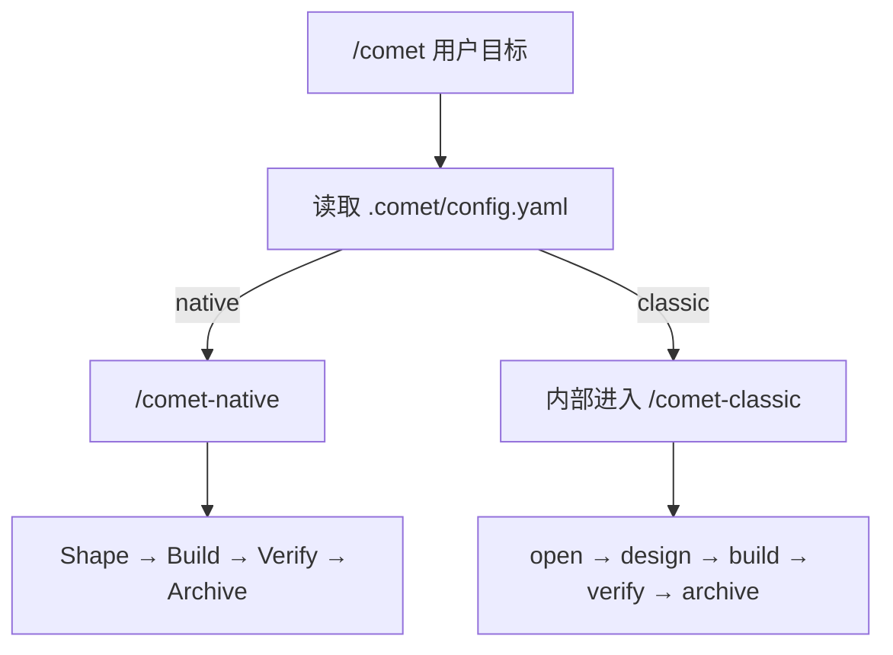

本页带你走完最短路径：安装 CLI、以默认 Native 初始化项目、在 Agent 平台里调用 `/comet`。

## 前置要求

- Node.js 22 或更高版本
- npm 或 npx
- Git
- 一个受支持的 AI 编码平台，例如 Claude Code、Codex、Cursor、Gemini CLI、OpenCode 或 ZCode

## 1. 安装 CLI

```bash
npm install -g @rpamis/comet
```

跑通标志：运行 `comet --version`，能输出版本号，说明安装成功。

## 2. 初始化项目（默认 Native）

进入你的项目根目录并运行：

```bash
cd your-project
comet init
```

按向导提示完成选择即可。初始化完成后，新项目默认启用 Native，并在项目根目录生成 `.comet/config.yaml`。

跑通标志：项目根目录出现 `.comet/config.yaml`。也可以运行 `comet doctor`，输出里没有 `✗` 失败项就说明安装完整。

<Accordion title="其他初始化情况">
  新项目默认 Native，上面的命令覆盖绝大多数情况。只有确实需要时才用下面的变体：

  如果你的项目已有明确的 Classic 状态，`comet init` 会保持 Classic，不要手动把这类项目改回 Native。需要显式选择工作流或 Native 产物目录（如 `docs`）时，使用 `--workflow`、`--root`、`--scope` 参数，例如：

  ```bash
  # 初始化 Native，产物放在 docs 目录
  comet init --workflow native --root docs

  # 初始化 Classic
  comet init --workflow classic

  # 同时初始化 Native 和 Classic
  comet init --workflow both

  # 全局安装 Native
  comet init --scope global --workflow native

  # 全局同时安装 Native 和 Classic
  comet init --scope global --workflow both
  ```

  只有 Classic 会安装或配置 OpenSpec、Superpowers 和 CodeGraph。项目级 Native、Classic 或 both 都会安装一份 Comet 工作流规则（Rule）；支持 Hook 的平台只会安装一个统一路由入口（Router），再按当前 change 把写入交给对应阶段的守卫（Guard）。

  global 安装会提供所选工作流的全局能力；尚未配置的项目首次明确调用 `/comet` 时，会把全局默认值固化到项目的 `.comet/config.yaml`，产物仍只写在项目内。已激活项目不会因之后的全局默认值变化而被改写。

  全部参数和配置合并规则见 [comet init](/zh/cli/init)；工作流取舍见 [Native 还是 Classic](/zh/native/native-vs-classic)。
</Accordion>

## 3. 调用 `/comet`

打开你的 Agent 平台，在项目里输入：

```text
/comet 实现用户资料页的头像上传能力
```

`/comet` 会读取 `.comet/config.yaml`，并将请求转发到 `/comet-native` 或 `/comet-classic` Skill。默认的 Native 会为需求创建 change，按 Shape → Build → Verify → Archive 管理目标、验收证据和归档；具体实现方法由模型根据项目情况决定。

跑通标志：Comet 回复已进入 Native 的 Shape 阶段并创建 change。也可以在终端运行 `comet status`，看到 `Native Changes` 下列出这个 change（查看方式见下方「查看状态」）。



<p align="center">
  
</p>

<p align="center">安装、初始化、调用 `/comet`，并在中断后从文件状态恢复</p>

## 查看状态

任何时候都可以运行：

```bash
comet status
```

你会看到默认入口，以及彼此分开的 Native、Classic 和未托管 OpenSpec changes。

使用 `comet doctor` 检查安装和配置：

```bash
comet doctor
```

## 继续中断的工作

如果会话中断，重新打开项目后输入：

```text
/comet 继续
```

Comet 会解析项目默认工作流，再从对应 change 和运行证据继续未完成的工作。

## 下一步

- 了解轻量工作流：阅读 [Native 工作流](/zh/concepts/native-workflow)。
- 需要经典五阶段强约束：详见 [Classic 工作流概念](/zh/concepts/workflow)。
- 想做快速修复：详见 [hotfix 预设](/zh/presets/hotfix)。
