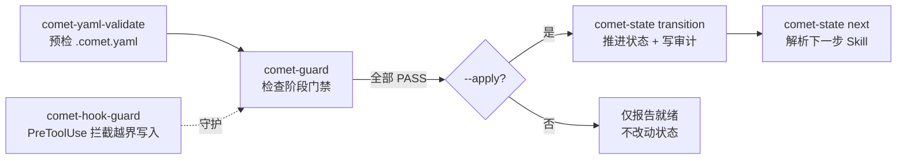

Comet 的内置脚本随 Skill 包分发，是五阶段工作流的"运行时底座"。0.4.0-beta.1 起，这些脚本全部从 Bash `.sh` 迁移到 Node `.mjs` 启动器，背后由一份共享的 TypeScript 运行时支撑——同一套命令在 Windows、macOS 和 Linux 上行为一致，**不再需要 Bash、Git Bash 或 WSL**。

## 为什么要从 `.sh` 换到 `.mjs`

0.3.x 时代，Comet 的状态、守卫、交接和归档逻辑由 7 个 Bash 脚本承担。这在 macOS 和 Linux 上工作良好，但 Windows 用户必须额外安装 Git Bash 或 WSL 才能跑完整工作流，路径转义和 shell 差异也常常带来隐患。

0.4.0-beta.1 把这些脚本重写为独立的 Node `.mjs` 命令包，带来了三点变化：

| 方面 | 0.3.x（Bash） | 0.4.0-beta.1（Node） |
| --- | --- | --- |
| 运行依赖 | Bash / Git Bash / WSL | 仅 Node.js 20+ |
| 跨平台 | Windows 需要额外 shell | Windows、macOS、Linux 同一套命令 |
| 实现来源 | 散落的 shell 逻辑 | 共享 TypeScript 运行时（`domains/comet-classic/`） |

每个 `.mjs` 启动器都是一个自包含的 esbuild 单文件包（约 300–370 KB），把 `yaml` 等依赖一并内联，因此不依赖 `node_modules`，也不依赖一个集中式的分发器。

## 脚本职责一览

| 脚本 | 职责 | 详细参考 |
| --- | --- | --- |
| `comet-env.mjs` | 脚本定位器：打印脚本目录绝对路径，是其他脚本的引导入口 | — |
| `comet-state.mjs` | 读取、设置和转换 `.comet.yaml`，并解析下一步 Skill | [comet-state](/zh/scripts/comet-state) |
| `comet-guard.mjs` | 检查阶段门禁；带 `--apply` 时校验通过后推进状态 | [comet-guard](/zh/scripts/comet-guard) |
| `comet-handoff.mjs` | 生成阶段交接包（design context / spec projection） | [comet-handoff](/zh/scripts/comet-handoff) |
| `comet-archive.mjs` | 调用 OpenSpec archive 并完成归档收尾 | [comet-archive](/zh/scripts/comet-archive) |
| `comet-yaml-validate.mjs` | 校验 `.comet.yaml` 字段、枚举和路径，是守卫的预检门 | — |
| `comet-hook-guard.mjs` | PreToolUse 写入钩子，按当前阶段阻止越界源码写入 | — |
| `comet-intent.mjs` | 解析 `/comet` 路由上下文，路由到 full / hotfix / tweak / resume | — |

<Note>
  这些脚本主要服务于 Skill 内部流程和高级排障。<strong>普通用户多数情况下不用直接运行它们</strong>——优先使用 <code>/comet</code>、<code>comet status</code> 和 <code>comet doctor</code> 即可。
</Note>

## Agent 如何定位脚本

Skill 内会先定位 `comet-env.mjs`，再由它打印出脚本目录。这样做是为了**不把用户机器路径硬编码进提示词**——不同平台、不同安装范围的目录结构差异很大。

`comet-env.mjs` 是唯一的非打包启动器，它把目录里的反斜杠统一成正斜杠，保证路径能安全地插值进任何 shell，也能被 Windows 上的 Node 原样接受：

```bash
# 引导：找到 comet-env.mjs 后运行一次
COMET_SCRIPTS_DIR="$(node "$COMET_ENV")"

# 从目录派生各个命令脚本
COMET_STATE="$COMET_SCRIPTS_DIR/comet-state.mjs"
COMET_GUARD="$COMET_SCRIPTS_DIR/comet-guard.mjs"
COMET_HANDOFF="$COMET_SCRIPTS_DIR/comet-handoff.mjs"
COMET_ARCHIVE="$COMET_SCRIPTS_DIR/comet-archive.mjs"
```

## 脚本如何协作

一次正常的阶段推进，背后是几个脚本的接力：



- **`comet-guard` 先跑 `comet-yaml-validate`** 作为预检；状态文件结构不合法时直接中止，不会继续检查门禁。
- **不带 `--apply`** 时，守卫只报告"是否就绪"，不改任何状态；带 `--apply` 时，校验全过后才会推进 `phase`。
- **`comet-state transition` 和 `comet-guard --apply` 共享同一份转移语义表**（`classic-transitions.ts`），所以两条推进路径的行为完全一致。
- **`comet-hook-guard`** 作为 PreToolUse 钩子常驻，在 `open`/`design`/`archive` 阶段阻止源码写入，把"提前写实现"挡在发生之前。

## 关键命令与标志

下表汇总最常用的子命令和标志。完整语义见各脚本的专属页面。

| 脚本 | 常用调用 | 说明 |
| --- | --- | --- |
| `comet-state` | `transition <change> <event>` | 触发状态转移事件，如 `open-complete`、`design-complete`、`verify-pass` |
| `comet-state` | `next <change>` | 输出 `NEXT: auto\|manual\|done` + `SKILL:` + `HINT:`（仅 manual） |
| `comet-state` | `set <change> phase <value>` | **默认被拒**；修复场景用 `COMET_FORCE_PHASE=1` 逃生口 |
| `comet-guard` | `<change> <phase> --apply` | 校验通过后推进状态，写入 `phase` 和审计事件 |
| `comet-guard` | `<change> <phase>` | 仅检查，不改状态；不通过时退出码为 1 |
| `comet-handoff` | `<change> design --write` | 生成 compact 交接包（超过 80 行截断） |
| `comet-handoff` | `<change> design --write --full` | 生成完整交接包；beta 压缩模式下会被忽略并警告 |
| `comet-handoff` | `--hash-only` | 只输出上下文 sha256，不写任何文件 |
| `comet-archive` | `<change>` | 执行归档：合并 spec、注解、迁移、置 `archived: true` |
| `comet-archive` | `<change> --dry-run` | 预演归档步骤，不改任何文件 |

<Warning>
  <code>COMET_FORCE_PHASE=1</code> 会绕过状态机的证据检查，只用于修复损坏的状态，不要当作常规推进手段。正常推进请用 <code>comet-state transition</code> 或 <code>comet-guard --apply</code>。
</Warning>

## 状态文件的三层拆分

0.4.0-beta.1 把每个 change 的状态从单一文件拆成了三份，各司其职：

| 文件 | 归属 | 内容 |
| --- | --- | --- |
| `.comet.yaml` | 用户可读 | 工作流投影字段（`workflow`/`phase`/`build_mode` 等）+ `run_id` 链接 |
| `.comet/run-state.json` | 机器管理 | 运行态检查点：当前步骤、迭代、待处理动作、快照引用 |
| `.comet/state-events.jsonl` | 追加式审计 | 成功转移的完整记录：event、source、from/to 状态、字段 effects |

- **`.comet.yaml` 保持 YAML 可读**，你可以直接看懂当前在哪个阶段；机器字段不再混在里面，避免手工误改。
- **`.comet/run-state.json`** 由运行时原子写入（临时文件 + 重命名），`comet-state set` 会拒绝直接写其中的 machine-owned 字段。
- **`.comet/state-events.jsonl`** 只追加、不覆盖，由 `comet-state transition`、`comet-guard --apply` 和 `comet-archive` 三处写入，给你一条可追溯的状态历史。

旧 change（Run 字段还嵌在 `.comet.yaml` 里）在首次读取时会自动迁移到拆分结构，无需手动处理。

## 在哪里能看到运行时证据

如果你想知道当前 change 走到了哪一步、状态是否健康，不必直接读这些脚本文件。优先用面向用户的命令：

```bash
comet status     # 当前阶段、下一步命令、风险信号
comet doctor     # 版本、安装范围、畸形状态、缺失证据、恢复建议
comet dashboard  # 浏览器里可视化查看阶段进度、产物、任务、风险
```

`status` 和 `doctor` 走的是和脚本相同的运行时证据路径，所以它们报告的问题就是脚本实际会拦截的问题。
