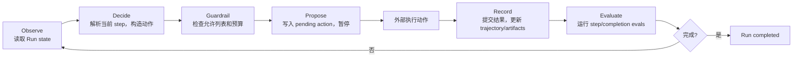
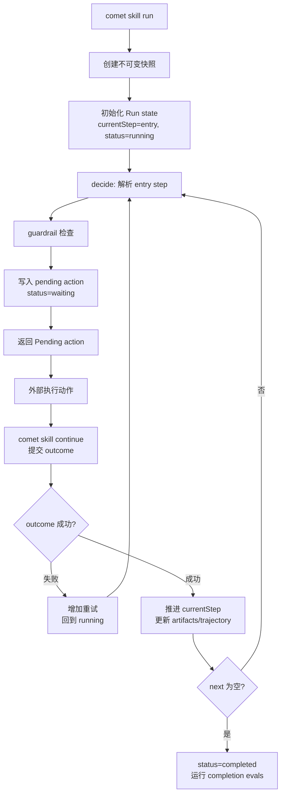
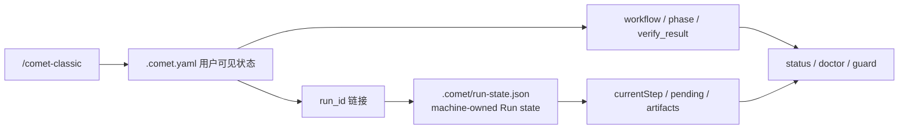

<Tip>
  创建、优化或组合 Skill 时，通常只需要在 Agent 里调用 <code>/comet-any</code>{' '}
  并按提示确认。除非你要调试 Engine Run、runtime checks
  或生成物结构，不需要先理解本页的底层机制。经典 Spec 模式的 <code>/comet-classic</code>{' '}
  用户也不需要理解 Engine 就能使用五阶段工作流。
</Tip>

Comet 的 Skill 不只是 Markdown 提示词。0.4.0-beta.1 起，Comet 内置了 **Skill Engine**——一个确定性运行时，负责执行、约束、持久化、恢复和评估 Comet Skill。它为多步骤 Skill 提供稳定内容 hash、不可变快照、pending action 恢复、guardrails 和 runtime check。

## 适用读者

| 你的目标                              | 建议                                                              |
| ------------------------------------- | ----------------------------------------------------------------- |
| 使用 `/comet` 跑经典五阶段工作流      | 不需要读本页，先看[快速开始](/zh/quickstart)                      |
| 用 `/comet-any` 创建或组合 Skill      | 先看[快速上手：组合任意 Skill](/zh/skill-creator/getting-started) |
| 发布 Skill                            | 先看[发布和分发 Skill](/zh/skill-creator/publishing)              |
| 调试 `comet skill run/continue/check` | 读本页                                                            |
| 编写 Engine-enabled Skill 包          | 读本页                                                            |

命令边界如下：

- `SKILL.md` 是人和 Agent 看到的入口说明。
- `comet/` 目录是运行时控制面，决定如何执行、恢复、检查和评估。
- `comet eval` 看发布前证据，`comet skill check` 看某次 Run 的运行期检查；两者不是同一件事。

## 三类 Skill

| 类型               | 来源                          | 常见入口                                      | 说明                                            |
| ------------------ | ----------------------------- | --------------------------------------------- | ----------------------------------------------- |
| 内置工作流 Skill   | 随包分发在 `assets/skills/`   | `/comet-classic`、`/comet-open`、`/comet-any` | 驱动五阶段流程和 Skill Creator                  |
| 项目 Skill         | 安装到 `.comet/skills/<name>` | `comet skill add`                             | 按名称覆盖内置 Skill，无效覆盖 fail closed      |
| Factory 生成 Skill | `/comet-any` 创建或组合       | `/comet-any`、`comet publish`                 | 生成后就是普通 Skill 包，可评估、可发布、可分发 |

### Skill 发现顺序

`resolveSkill` 按以下顺序查找，找到即停止：

1. **explicit** — selector 指向一个已存在的目录，直接加载。路径不存在会报错，不会继续找。
2. **project** — `<projectRoot>/.comet/skills/<selector>`，**优先于内置**，所以项目可以按名称覆盖内置 Skill。
3. **builtin** — `assets/skills/<selector>`。
4. 都没找到 → **fail closed**，不静默回退。

<Warning>
  项目 Skill 按名称覆盖内置 Skill 时，如果项目 Skill
  无效时会直接失败，并禁止回退到内置版本。这可以防止自定义版本无效时静默降级。
</Warning>

## Skill 包结构

Engine-enabled Skill 除 `SKILL.md` 外，还包含 `comet/` 控制面：

<Tree>
  <Tree.Folder name="<skill-name>/" defaultOpen>
    <Tree.File name="SKILL.md" />
    <Tree.Folder name="comet/" defaultOpen>
      <Tree.File name="skill.yaml" />
      <Tree.File name="guardrails.yaml" />
      <Tree.File name="checks.yaml" />
      <Tree.File name="evals.yaml" />
      <Tree.File name="eval.yaml" />
    </Tree.Folder>
    <Tree.Folder name="evals/" defaultOpen>
      <Tree.File name="evals.json" />
    </Tree.Folder>
    <Tree.Folder name="scripts/" />
    <Tree.Folder name="references/" />
    <Tree.Folder name="assets/" />
  </Tree.Folder>
</Tree>

### 各文件职责

| 文件                                      | 生命周期        | 职责                                                          | 被谁加载                                  |
| ----------------------------------------- | --------------- | ------------------------------------------------------------- | ----------------------------------------- |
| `comet/skill.yaml`                        | 运行期 + 创建期 | Skill 定义：goal、orchestration、skills、agents、tools        | `loadSkillPackage`                        |
| `comet/guardrails.yaml`                   | 运行期          | 覆盖默认 guardrails（允许列表、预算、确认要求）               | `loadSkillPackage`                        |
| `comet/checks.yaml` 或 `comet/evals.yaml` | 运行期          | runtime checks（progress/step/completion），二选一            | `loadSkillPackage` → `SkillPackage.evals` |
| `comet/eval.yaml`                         | 创建期          | 创建期评估 manifest（task、quality gates、expected evidence） | `comet eval` / Bundle 后端                |

<Note>
  <strong>容易混淆的命名：</strong>复数 <code>evals.yaml</code>（或 <code>checks.yaml</code>
  ）是运行期 eval，由 Engine 在运行时检查；单数 <code>eval.yaml</code> 是创建期评估 manifest，由{' '}
  <code>comet eval</code> 在发布前验证。两者生命周期不同，不能混为一谈。<code>checks.yaml</code> 和{' '}
  <code>evals.yaml</code> 不能同时存在。
</Note>

## Skill 定义：skill.yaml

`skill.yaml` 描述一个 Skill 的目标、编排方式和声明的能力：

```yaml
apiVersion: comet/v1alpha1
kind: Skill
metadata:
  name: comet-classic
  version: '1'
goal:
  statement: '驱动五阶段可恢复工作流'
  inputs: []
  outputs: []
  success: []
orchestration:
  mode: deterministic
  entry: full.open
  steps:
    - id: full.open
      action:
        type: invoke_skill
        ref: comet-open
      next: full.design
    # ...更多步骤
skills: [comet-open, comet-design, comet-build, ...]
agents: []
tools: []
```

关键字段：

| 字段                          | 含义                                                                         |
| ----------------------------- | ---------------------------------------------------------------------------- |
| `goal`                        | Skill 目标、输入、输出和成功标准——runtime completion eval 的基础，必须可观测 |
| `orchestration.mode`          | `deterministic`（静态步骤图）或 `adaptive`（Agent 驱动）                     |
| `orchestration.entry`         | deterministic 模式必须指定，引用一个已知 step id                             |
| `orchestration.steps`         | 步骤图，每个 step 有 `id`、`action`、`next`、可选 `completionEvals`          |
| `skills` / `agents` / `tools` | 声明可用的能力，guardrails 的允许列表只能引用已声明项                        |

### 步骤动作类型

每个 step 的 `action.type` 是以下之一：

| 类型           | 含义                            |
| -------------- | ------------------------------- |
| `invoke_skill` | 调用另一个 Comet Skill          |
| `call_tool`    | 调用工具（含脚本工具）          |
| `handoff`      | 移交控制                        |
| `ask_user`     | 向用户提问（必须有 `question`） |
| `checkpoint`   | 检查点（通常用于终止 step）     |

## 两种编排模式

两种模式共享**同一个执行循环**。区别在于谁来决定下一步动作。

### deterministic（确定性）

- 步骤是一个静态图，`entry` 指定起点，每个 step 的 `next` 指定下一步。
- Engine 自己解析当前 step → 构造动作 → 过 guardrails → 暂停等结果。
- 成功后推进到 `next`；失败则增加重试计数、停留在当前 step。
- `next` 为空时 Run 完成。`comet skill run` 目前只支持 deterministic 端到端执行。

### adaptive（自适应）

- 不能定义 `entry` 或 `steps`。
- Engine **不自己提议动作**——由外部 Agent 提议，通过 `acceptAdaptiveAction` 注入，同样过 guardrails。
- 完成由 evals/Agent 驱动，没有 `next: null` 终止 step。
- 循环层已就绪并有测试覆盖，但 `comet skill run` 的公开入口目前会拒绝 adaptive 包。

<Tip>
  如果你写的是多步骤、需要恢复的 Skill，用 deterministic。adaptive 是为 Agent
  自主决策场景准备的，目前 loop-ready 但尚未通过 CLI 暴露。
</Tip>

## Engine 运行循环

Engine 的核心是一个 ReAct 风格的循环，但 Engine 本身**不执行副作用**——它只负责决定、约束、记录、评估，真正的动作执行交给外部（Agent、平台或人）。



<p align="center">
  
</p>

<p align="center">Engine 只提议、约束和记录；真正的副作用由外部执行后再 resume</p>

### pending action：为什么暂停

pending action 是 Engine 把控制权交回给执行者的机制。Engine 提议一个动作后，Run 状态变成 `waiting`，直到外部提交这个动作的结果（`ActionOutcome`）。

为什么要暂停：Engine 是确定性状态机，自己不做实际工作（不调模型、不写代码）。它把"该做什么"写入 pending action 持久化到磁盘，外部执行完再通过 `resume` 提交结果。这同时让 Run **跨进程可恢复**——pending action 在磁盘上，新进程读它就能继续。

动作 id 是确定性的：`sha256(runId:iteration:stepId)` 的前 16 位。

## Run 生命周期



### run：启动

1. 拒绝 adaptive 包（目前）。
2. 拒绝已存在的 Run（change 模式一个目录只能有一个 Run）。
3. **创建不可变快照**——把整个 Skill 包冻结到 `.comet/skill-snapshots/<hash>/`，hash 锁定到 Run 的 `skillHash`。
4. 初始化 Run state：`currentStep = entry`，`status = running`。
5. 记录 `run_started` trajectory 事件。
6. `decide` 解析 entry step、构造第一个动作、过 guardrails、写入 pending action、`status = waiting`。

### resume：提交结果或恢复

带 outcome（实际推进）：

1. 验证提交的 outcome 对应当前 pending action id。
2. 合并 outcome 的 artifacts 到 artifacts 存储。
3. 记录 `action_completed` trajectory 事件。
4. `recordOutcome`：清除 pending，失败则增加重试，成功则推进 `currentStep`。
5. 运行 step-scope evals。
6. 如果 `next` 为空，`status = completed`，运行 completion-scope evals。
7. 否则再次 `decide` 提议下一个动作。

不带 outcome（查看/重新决定）：

- 返回当前 pending action（如果存在）。
- 或在没有 pending 时重新提议下一个动作。

### eval：按需检查

`comet skill check` 按需对持久化的 Run state 和 artifacts 重跑 evals，逐项输出 `PASS`/`FAIL`：

```bash
comet skill check --run-id demo-run --scope completion
```

## 不可变快照

每次 Run 启动时，Engine 把 Skill 包冻结成一个不可变快照。

### hash 怎么算

对 `{ definition, guardrails, evals }` 做稳定 JSON（key 按字母排序），加上 `SKILL.md` 和每个脚本工具 source 的 `{ path, sha256 }`，最终算一个 SHA-256。

### 为什么重要

- **Run 锁定到启动时的 Skill 版本**：之后修改 `skill.yaml` 不影响进行中的 Run。恢复时从快照重新加载，不是读工作区的最新文件。
- **防篡改**：重新加载快照时会重算 hash 验证完整性。
- **可复现**：同一个快照 + 同样的 outcome 序列产生同样的 Run 轨迹。

### 升级运行中 Skill

修改进行中 Run 的 Skill 版本的唯一合法方式是显式升级（`--upgrade`）：

```bash
comet skill continue --run-id demo-run --upgrade my-skill --project .
```

升级有严格守卫：不能有 pending action、Skill 名称必须匹配、编排模式必须匹配、当前 step 必须在新版本里仍存在。升级后记录 `state_migrated` 事件。

## guardrails

guardrails 约束 Engine 能执行什么动作，由 `guardrails.yaml` 覆盖默认值。

### 默认值

`guardrails.yaml` 不存在时，默认：允许列表 = definition 声明的所有 skills/agents/tools，`maxIterations = 50`，`maxRetriesPerAction = 3`，`confirmationRequiredFor` = 所有标记 `requiresConfirmation: true` 的工具。

### 约束检查

每个动作在提议前都过 `checkAction`：

| 检查                                      | 失败行为                      |
| ----------------------------------------- | ----------------------------- |
| `iteration >= maxIterations`              | 阻塞：iteration 预算耗尽      |
| 动作的 ref 不在允许列表                   | 阻塞：skill/tool/agent 未声明 |
| ref 需要 confirmation 但未提供            | 阻塞：需要用户确认            |
| `retries[actionId] > maxRetriesPerAction` | 阻塞：重试预算耗尽            |

<Warning>
  动态重新规划<strong>不能放宽 guardrails</strong>。允许列表和预算由 Skill 固定，运行时的 Agent
  无法在运行中扩大它们。这是 Engine 安全性的核心——Skill 定义了边界，执行者只能在边界内行动。
</Warning>

### 示例

```yaml
# comet-classic 的 guardrails
allowedSkills:
  [comet-open, comet-design, comet-build, comet-verify, comet-archive, comet-hotfix, comet-tweak]
allowedAgents: []
allowedTools: []
maxIterations: 500
maxRetriesPerAction: 3
confirmationRequiredFor: []
```

## runtime checks

runtime checks 是 Engine 在运行时检查 Run 是否满足条件，和创建期 eval（`comet eval`）不同。

### 两种检查类型

| 类型              | 判断方式                          |
| ----------------- | --------------------------------- |
| `artifact_exists` | artifacts 存储里有对应的 artifact |
| `state_equals`    | Run state 的某个字段等于指定值    |

### 三个作用域

| scope        | 何时运行                           | 命令                                 |
| ------------ | ---------------------------------- | ------------------------------------ |
| `step`       | 每次提交 action outcome 后自动运行 | 自动                                 |
| `completion` | Run 到达 completed 时自动运行      | 自动                                 |
| `progress`   | 按需运行                           | `comet skill check --scope progress` |

### 示例

```yaml
# comet-classic 的 runtime check（evals.yaml）
runtime:
  - id: classic-completed
    scope: completion
    type: state_equals
    field: status
    equals: completed
```

这个 eval 在 Run 完成时检查 `status === completed`。

<Warning>
  <code>comet skill check</code> 只检查某次 Engine Run 的完成度，不是通用 Skill 评估。评估一个 Skill
  的产品能力能否发布，用 <a href="/zh/cli/eval">comet eval</a>。详见{' '}
  <a href="/zh/eval/runtime">Runtime check</a>。
</Warning>

## 创作通道（authoring lanes）

`/comet-any` 通过**创作通道**（authoring lanes，每条通道负责一类产物）分类组装 Skill 包。每个通道负责一类产物，有自己的作者（deterministic-adapter 或 subagent），并按顺序完成渲染。

| 通道              | 产出                                | 关键 artifact                                                                                                                                    |
| ----------------- | ----------------------------------- | ------------------------------------------------------------------------------------------------------------------------------------------------ |
| `workflow-entry`  | 入口 Skill                          | `SKILL.md`                                                                                                                                       |
| `skill-core`      | 每个 Workflow Node 对应的内部 Skill | 各节点 `../<node-skill>/SKILL.md`                                                                                                                |
| `script-contract` | 控制面脚本                          | `scripts/workflow-state.mjs`、`workflow-guard.mjs`、`workflow-handoff.mjs`、`comet-plan.mjs`、`comet-check.mjs`、`comet-hook-guard.mjs`          |
| `reference`       | 真实来源、协议和组合证据            | `reference/resolved-skills.json`、`workflow-protocol.json`、`composition-report.md`、`decision-points.md`、`recovery.md`、`authoring-lanes.json` |
| `eval`            | 评估清单（Engine 启用时）           | `comet/eval.yaml`                                                                                                                                |
| `skill-review`    | 作者自审（最后跑）                  | `reference/skill-review.md`、`authoring-lanes.json`                                                                                              |

每个通道的产出都会带 `protocolHash`，必须等于 `workflowProtocolHash(workflow)`，否则抛 `Factory authoring protocol hash drift`。

### 评审门禁

生成完成后，`reviewFactoryArtifactProposals` 是强制评审门禁。它会检查：

- **必需通道**是否齐全（`workflow-entry` / `skill-core` / `script-contract` / `reference` / `skill-review`，Engine 启用时还有 `eval`）。
- **必需 artifact** 是否存在（`SKILL.md`、`reference/workflow-protocol.json`、`decision-points.md`、`recovery.md`、`composition-report.md`、`resolved-skills.json`、`skill-review.md`、六个控制面脚本等）。
- **必需 claim** 是否存在且引用的 artifact 存在（`workflow-entry`、`script:workflow-state` 等）。
- 产物与 Workflow Contract 一致（节点、Output Schema、Required Skill Call 对得上）。

如果评审不通过（`passed === false`），`generateFactorySkillPackage` 抛 `Generated Skill package failed authoring review`，**不写任何文件**。

<Tip>
  这套通道设计是为了让平台可以用原生 subagent 并行产出 artifact（每个 subagent 只读自己的
  brief）。当平台不支持 subagent 时，相同的 brief
  会内联运行作为兜底。日常使用不需要关心这些，理解"每个产物都有作者和评审"即可。
</Tip>

## Run state 存储

Run state 由 Engine 自动维护（machine-owned），不要手工编辑。

### 两种存储位置

| runnerMode   | 存储位置                             | 特点                                                                              |
| ------------ | ------------------------------------ | --------------------------------------------------------------------------------- |
| `change`     | `<changeDir>/.comet/`                | 绑定 OpenSpec change 目录，一个目录一个 Run。经典 `/comet-classic` 工作流用这种。 |
| `standalone` | `<projectRoot>/.comet/runs/<runId>/` | 独立 Run，用 runId 寻址，多个 Run 并存                                            |

### run-state.json 字段

```json
{
  "runId": "demo-run",
  "skill": "my-skill",
  "skillVersion": "1",
  "skillHash": "<sha256>",
  "orchestration": "deterministic",
  "currentStep": "step-1",
  "iteration": 3,
  "pending": "<action-id>",
  "status": "waiting",
  "retries": {}
}
```

### 五个附属文件

| 文件                         | 内容                           |
| ---------------------------- | ------------------------------ |
| `.comet/pending-action.json` | 当前等待的 pending action      |
| `.comet/trajectory.jsonl`    | append-only 轨迹审计记录       |
| `.comet/context.md`          | 当前 Agent 上下文              |
| `.comet/artifacts.json`      | 产出的 artifacts 映射          |
| `.comet/checkpoint.json`     | 一致性检查点（经典迁移时写入） |

所有文件 IO 都沙箱化在 change/run 目录内，拒绝绝对路径、`~`、盘符和 `..` 路径穿越。写入是原子的（写 tmp 再 rename）。

## 经典工作流和 Engine 的关系

经典 `/comet-classic` 五阶段工作流在底层由 Engine 驱动，但用户不需要直接操作 Engine。



### .comet.yaml 和 run-state.json 的边界

- `.comet.yaml` 保存用户可理解的工作流投影（phase、build_mode、verify_result 等），只通过 `run_id` 链接到 Engine Run。
- 完整的 Run 细节（currentStep、pending、trajectory、artifacts）在 `.comet/run-state.json`，不写进 `.comet.yaml`。
- 首次进入一个 change 时，`ensureClassicRun` 从 `.comet.yaml` 的 classic 字段推导当前 step，创建快照和 Run state，建立 `run_id` 链接。

<Note>
  Engine 内部的 <code>comet-classic</code> 定义是一个 deterministic Skill，有 30 个步骤覆盖
  full/hotfix/tweak 三种 profile。用户通过永久入口 <code>/comet-classic</code>（或由项目配置驱动的{' '}
  <code>/comet</code> 别名转发）进入，不直接操作这些内部 YAML；Engine 在底层加载并运行它们。
</Note>

#### Classic 控制包的打包方式

`comet-classic` 作为**内部控制包**以纯 YAML 形式打包在 `comet/runtime/classic/` 下，包含三个文件：

| 文件                                    | 内容                                                                      |
| --------------------------------------- | ------------------------------------------------------------------------- |
| `comet/runtime/classic/skill.yaml`      | deterministic 编排图（30 步，full/hotfix/tweak 三种 profile）             |
| `comet/runtime/classic/guardrails.yaml` | 允许的 7 个公开 Skill、`maxIterations: 500`、`maxRetriesPerAction: 3`     |
| `comet/runtime/classic/checks.yaml`     | runtime check（`classic-completed`：completion 时 `status == completed`） |

这里的 Engine 定义**不是**用户调用的顶层 `comet-classic/` 入口目录。内部安装产物是这三个 YAML，由 `assets/manifest.json` 的 `internalSkills` 注册并由 Engine 加载；顶层 `/comet-classic` 只负责稳定入口与工作流编排。

## 什么时候用 /comet-any

如果你想把一个工作流变成团队可复用 Skill，不要从手写 Engine 文件开始。用 `/comet-any` 让它读取真实 Skill、生成结构化证据、评估并进入发布门禁。

正常用户路径是：

```text
/comet-any -> comet eval -> comet publish
```

详见[组合任意 Skill 快速上手](/zh/skill-creator/getting-started)。

## 常见命令

```bash
# 包管理
comet skill add ./my-skill --project .
comet skill show my-skill --project .
comet skill show my-skill --json

# Run 生命周期
comet skill run my-skill --run-id demo-run --project .
comet skill continue --run-id demo-run --status succeeded --summary "完成"
comet skill check --run-id demo-run --scope completion

# 升级进行中的 Run
comet skill continue --run-id demo-run --upgrade my-skill --project .
```

完整选项见 [comet skill](/zh/cli/skill)。

## 下一步

- [工作流概念](/zh/concepts/workflow) — `/comet-classic` 如何在底层使用 Engine
- [comet skill](/zh/cli/skill) — 完整命令参考
- [Runtime check](/zh/eval/runtime) — `comet skill check` 和 `comet eval` 的区别
- [Skill Creator 概览](/zh/skill-creator/overview) — 用 `/comet-any` 创建 Engine-enabled Skill
