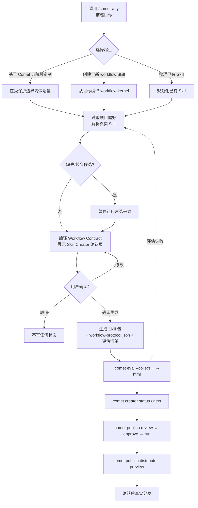

<Tip>
  创建、优化或组合 Skill 时，通常只需要在 Agent 里调用 <code>/comet-any</code> 并按提示确认。评估、发布、分发和恢复会由流程引导；除非排障或自动化集成，不需要先关心底层命令、内部状态或生成物结构。
</Tip>

`/comet-any`（也叫 **Skill Creator**）是 Comet 创建、优化和组合可复用 Skill 的唯一入口。本页是它的最短上手路径——只讲怎么用，不讲内部机制。想深入理解再看[进阶内容](#进阶内容)。

<Warning>
  组合任意 Skill 仍是实验性功能。后续版本可能对流程、命令接口、生成物结构和发布门禁做大幅重构，也可能移除或替换部分能力。建议先在非关键项目中试用，并在升级 Comet 前查看 changelog。
</Warning>

## 适合谁

- 想把团队某个反复出现的流程沉淀成一个**可复用 Skill**，而不是每次重新描述。
- 想在经典 `/comet` 五阶段基础上**增加、替换或关闭**某些环节。
- 想把已有但散乱的 Skill **整理**成可评估、可发布、可分发的标准 Skill 包。

## 你需要先准备什么

1. **已安装 Comet**。运行 `comet doctor` 确认 CLI 正常。如果还没装，见 [CLI 快速上手](/zh/cli/quickstart)。
2. **一个支持 Skill 的 Agent 平台**，例如 Claude Code、Codex、Cursor 等。`/comet-any` 是在这些平台里调用的 Skill，不是独立的终端命令。
3. **(可选) 项目级偏好文件**。第一次使用时 `/comet-any` 会自动扫描平台并推荐默认偏好，你可以跳过这步。想提前配置，见[可选：准备偏好文件](#可选准备偏好文件)。

<Note>
  <code>/comet-any</code> 是 <strong>用户唯一需要记住的入口</strong>。需要看恢复状态时用 <code>comet creator</code>；进入发布后再用 <code>comet publish</code>。日常使用不需要直接跑 <code>comet bundle</code>。
</Note>

## 主线：记住这一条

```text
/comet-any 创建  →  comet eval 验证  →  comet creator status/next 看下一步  →  review/approve/run  →  distribute
```

你只需要调用 `/comet-any`。如果流程中断，优先运行 `comet creator next <name>` 看唯一推荐下一步；如果要看完整 readiness、blocker 和证据，再运行 `comet creator status <name>`。下面用一次真实创建走完整条链路。

<p align="center">
  
</p>

<p align="center">`/comet-any` 负责创建 Skill，`comet eval` 给证据，`comet creator next/status` 把中断流程翻译成下一条用户命令</p>

---

## 第一步：调用 /comet-any 并描述目标

在 Agent 平台里输入：

```text
/comet-any
```

然后描述你想创建的 Skill。**描述越具体，生成的 Skill 质量越高**。一个好的描述至少包含：做什么、分几步、给谁复用。例如：

```text
请创建一个 PR 评审助手。
它要先澄清评审范围，再制定检查计划，再执行代码审查，
最后在完成前要求验证证据。
目标是给团队复用，不只是当前一次任务。
```

## 第二步：选择起点

`/comet-any` 会让你从**三种起点**里选一个。这是 Skill Creator 的第一层选择，决定了整个生成方式：

| 起点 | Skill Creator 意图 | 含义 | 典型场景 |
| --- | --- | --- | --- |
| **基于 Comet 现有 Skill 的五阶段定制** | `customize-comet` | 在经典五阶段上做增量调整 | 想给 `/comet` 加一个评审环节、要求用组件库 |
| **创建全新 workflow Skill** | `new-skill` | 从目标描述创建全新工作流 | 沉淀一个团队专属流程 |
| **整理已有 Skill** | `upgrade-existing` | 把现有 Skill 整理成可发布的标准包 | 把散乱的 Skill 规范化 |

不管选哪种起点，`/comet-any` 最终都会把目标编译成同一种 **Workflow Contract**（由 Workflow Node、Skill Binding、Required Skill Call、Output Schema、Guardrail、Handoff 组成）。详见[Skill Creator 概览](/zh/skill-creator/overview#workflow-contract所有路径的共同模型)。

<Warning>
  选择<strong>基于 Comet 现有 Skill 的五阶段定制</strong>时，<code>/comet</code> 被视为<strong>受保护边界</strong>：control 节点（<code>open</code>/<code>execute</code>/<code>verify</code>/<code>archive</code>）不能被替换实现，你只能对节点<strong>增加 Required Skill Call、增强（augment）、关闭（仅可选节点）</strong>。
</Warning>

## 第三步：确认组合方案（Skill Creator 确认页）

`/comet-any` 会读取项目里的真实 Skill，把目标编译成 **Workflow Contract**，生成一个**组合方案**，然后**暂停等你确认**。这一页叫"Skill Creator 方案确认页"，是整个流程的关键检查点。它会展示：

- 你在做什么类型的 Skill（Skill Creator 意图）、目标是什么
- **保留**哪些节点、**新增**哪些 Required Skill Call、**替换**哪些节点实现、**关闭**哪些可选节点
- **不能做**什么（例如替换 control 节点会被拒绝）
- 每个节点的职责、实现 Skill、必须调用的 Skill、Output Schema
- Workflow Contract 类型（`comet-five-phase-overlay` / `workflow-kernel`）和 Output Schemas 列表
- 是否有缺失或歧义候选需要你处理
- scripts / hooks 会带来什么**可执行披露**
- 将生成哪些文件

你需要做**三选一**：

1. **确认生成** — 按方案写入 draft，继续生成。
2. **修改方案** — 调整目标、偏好或候选后重新生成方案。
3. **取消** — 不写任何状态。

<Tip>
  如果 <code>/comet-any</code> 提示有候选<strong>缺失</strong>或有<strong>多个来源</strong>，它一定会暂停问你——它绝不会替你选择或静默忽略。按提示选来源即可。这是硬规则，不是可选行为。
</Tip>

## 第四步：评估

确认后，`/comet-any` 生成 Skill 包。然后评估它是否达标。这是发布前的**强制证据**，不是可选步骤：

```bash
# 1. 低成本发现预检查（不消耗模型调用）
comet eval ./generated-skill/comet/eval.yaml --collect

# 2. 执行真实评估，生成可浏览的 HTML 报告
comet eval ./generated-skill/comet/eval.yaml --html
```

打开 CLI 打印的 `Report path`，确认评估通过。详细的环境准备和报告解读见[评估任意 Skill](/zh/eval/quickstart)。

<Info>
  <strong>前提</strong>：运行 <code>comet eval</code> 需要本机有 <code>uv</code>、Python 3.11+、Docker，并设置了 <code>ANTHROPIC_API_KEY</code>（或 <code>ANTHROPIC_AUTH_TOKEN</code>）。完整的准备工作见<a href="/zh/eval/quickstart#运行前你需要准备什么">评估快速上手 · 运行前你需要准备什么</a>。
</Info>

## 第五步：发布和分发

评估通过后，检查发布 readiness 并发布：

```bash
# 查看完整 readiness 和阻塞项
comet creator status my-skill --project . --json

# 只想知道下一步该跑什么
comet creator next my-skill --project . --json

# 生成评审摘要（看 Readiness / Blockers / Evidence）
comet publish review my-skill --platform claude --json

# 人工批准当前版本
comet publish approve my-skill --reviewer alice --json

# 发布
comet publish run my-skill --platform claude --json
```

分发到平台**前**会先强制跑预览，确认后才会真正写入：

```bash
# 强制预览（不会写任何文件）
comet publish distribute my-skill --platform claude --scope project --preview --json

# 确认预览无误后，真实分发
comet publish distribute my-skill --platform claude --scope project --json
```

完整的发布状态链和门禁见[发布和分发 Skill](/zh/skill-creator/publishing)。

<Tip>
  <code>/comet-any</code> 也会主动推进这些步骤并在每一步询问你确认。上面这些命令是<strong>可选的手工路径</strong>，用于排障或自动化。
</Tip>

---

## 完整流程一图看懂



## 可选：准备偏好文件

第一次使用时 `/comet-any` 会扫描平台 Skill 并推荐默认偏好，你也可以直接创建偏好文件，告诉它优先复用哪些 Skill。保存到 `.comet/skill-preferences.yaml`：

```yaml
# .comet/skill-preferences.yaml
version: 1
mode: advisory

prefer:
  - brainstorming
  - writing-plans
  - requesting-code-review
  - verification-before-completion

require:
  - verification-before-completion

policies:
  missing: ask
  ambiguous: ask
  deviation: explain
  scripts: disclose
  hooks: disclose
```

完整字段含义见[Skill 偏好与真实来源](/zh/skill-creator/preferences)。

## 常见问题

<AccordionGroup>
  <Accordion title="/comet-any 和 /comet 有什么区别">
    <code>/comet</code> 用来完成一个项目变更。<code>/comet-any</code> 用来创建、优化或整理可复用 Skill。

    想做功能、修 bug 或改项目代码，用 <code>/comet</code>。想把一套流程沉淀成可复用 Skill，或在 <code>/comet</code> 五阶段基础上增加团队规则，用 <code>/comet-any</code>。
  </Accordion>

  <Accordion title="我需要理解 Workflow Node、Output Schema 这些词吗">
    普通使用不需要。你只需要看方案确认页里每一步做什么、会调用哪些 Skill、哪些能力会被增加或关闭。

    要做深度定制或审查生成物时，再看[Skill Creator 概览](/zh/skill-creator/overview)。
  </Accordion>

  <Accordion title="做到一半中断了怎么办">
    直接对 Agent 说"继续上次的 Skill 创建"。<code>/comet-any</code> 会先尝试<strong>恢复现有创作状态</strong>，展示名称、状态、下一步和阻塞原因，让你选择继续哪一个。详见[创建 Skill 的完整流程 · 恢复中断流程](/zh/skill-creator/workflow#恢复中断流程)。
  </Accordion>

  <Accordion title="生成物会被自动分发吗">
    不会。<code>/comet-any</code> 发布后会询问你是否分发，并<strong>先展示预览</strong>。只有你确认后才会真正写入平台。预览是强制步骤，不能跳过。
  </Accordion>

  <Accordion title="我不想自己跑 eval 和 publish 命令">
    你可以全程只调用 <code>/comet-any</code>，它会主动推进评估和发布并在每一步问你确认。本页列出命令是为了让你理解流程、方便排障或做自动化集成。
  </Accordion>
</AccordionGroup>

## 进阶内容

基础路径到这里就结束了。如果你需要更深入地理解 Skill Creator，看这些页面：

| 进阶主题 | 适合场景 |
| --- | --- |
| [Skill Creator 概览](/zh/skill-creator/overview) | 理解 Workflow Contract、三种起点、受保护边界和内置节点 |
| [创建 Skill 的完整流程](/zh/skill-creator/workflow) | 从恢复状态到生成、评估、评审、发布、分发的每一步详解 |
| [Skill 偏好与真实来源](/zh/skill-creator/preferences) | `advisory`/`strict` 模式、策略、`resolved-skills.json` 证据 |
| [发布和分发 Skill](/zh/skill-creator/publishing) | readiness 状态链、门禁、能力缺口和可执行披露 |
| [Skill 与 Engine](/zh/skill-creator/engine) | Skill 包结构、Engine 运行循环、runtime check、不可变快照 |
