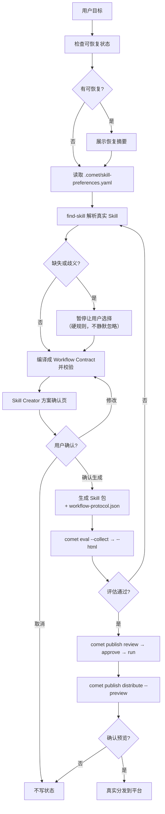

<Tip>
  创建、优化或组合 Skill 时，通常只需要在 Agent 里调用 <code>/comet-any</code> 并按提示确认。评估、发布、分发和恢复会由流程引导；除非排障或自动化集成，不需要先关心底层命令、内部状态或生成物结构。本页是进阶内容，如果只想快速创建一个 Skill，先看[快速上手：组合任意 Skill](/zh/skill-creator/getting-started)。
</Tip>

`/comet-any` 是 Comet 的 Skill 创建入口，也叫 **Skill Creator**。你描述想要的工作流，它读取真实本地 Skill、把目标编译成一份 **Workflow Contract**，再生成**可验证、可评审、可分发**的 Skill Bundle，并把后端复杂度（Bundle、Factory、composition、resolved-skills）隐藏在内部。

## 核心设计原则

使用入口和内部产物分为两层：

| 层 | 内容 | 谁会接触 |
| --- | --- | --- |
| **用户层** | 三种起点 + `保留 / 新增 / 替换 / 关闭` 的调整词汇 + 每个节点的职责说明 | 所有用户 |
| **内部层** | Bundle、Factory、composition、Workflow Protocol、resolved-skills.json | 仅审计/排障时查看 |

创建入口是 `/comet-any`。`comet creator` 查看或恢复创建状态，`comet publish` 处理发布，`comet bundle` 用于后端审计和排障。

## 主线

```text
/comet-any 创建  →  comet eval 验证  →  comet creator 查状态  →  comet publish 发布和分发
```

展开后的处理顺序：

```text
/comet-any 创建
  → comet eval --collect / --html（验证）
  → comet creator status / next（readiness 和唯一的下一步）
  → comet publish review / approve / run（发布）
  → comet publish distribute --preview（强制预览）
  → comet publish distribute（真实分发）
```

`comet creator` 负责查看和恢复 `/comet-any` 的创建流程；`comet bundle` 是高级 Bundle 后端；`comet skill` 是底层 Skill 工具，适合本地调试和 Engine Run。它们都**不是**日常创建 Skill 的主入口。

## 三种起点

用户第一层只需要从三种起点里选一个。它们对应三种 **Skill Creator 意图**（`skillCreatorIntent`），后端会把每条路径都编译到同一种 Workflow Contract：

| 起点（用户层） | Skill Creator 意图 | 含义 | 典型场景 |
| --- | --- | --- | --- |
| **基于 Comet 现有 Skill 的五阶段定制** | `customize-comet` | 在 `/comet` 受保护边界内做增量调整 | 给 `/comet` 增加 `grill-me` 需求澄清 Skill |
| **创建全新 workflow Skill** | `new-skill` | 从目标描述生成新的 workflow-kernel | 沉淀一个团队专属流程 |
| **整理已有 Skill** | `upgrade-existing` | 把现有 Skill 整理成可发布标准包 | 把散乱的 Skill 规范化 |

## Workflow Contract：所有路径的共同模型

不管你选哪种起点，`/comet-any` 最终都会把目标编译成同一种 **Workflow Contract**。这是理解整个 Skill Creator 的核心概念：

| 概念 | 含义 |
| --- | --- |
| **Workflow Node** | 流程中的可恢复节点，例如 `open`、`design`、`plan`、`execute`、`review`、`verify`、`archive` |
| **Node Responsibility** | 该节点在 Agent workflow 里承担的职责，用来解释它为什么存在、要产出什么、能否替换 |
| **Skill Binding** | 某个节点的实现 Skill 或辅助 Skill |
| **Required Skill Call** | 要求节点内**必须调用**某个 Skill，但**不替换**节点的实现。例如要求 `open` 必须调用 `grill-me` 澄清需求 |
| **Output Schema** | 节点必须产出的文件、状态或 evidence。脚本、eval、readiness 只认 Output Schema，不认 Skill 名字 |
| **Guardrail** | 阻断或放行节点推进的检查 |
| **Handoff** | 子代理或跨节点交接时必须带回的 evidence |
| **workflow-protocol.json** | 生成包运行状态的**唯一可信来源**，runtime / eval / review / readiness 都读它 |

<p align="center">
  
</p>

<p align="center">不管从新建、升级还是组合开始，最终都要落到同一份 Workflow Contract</p>

### 两类 Workflow

<Columns columns={2}>
  <Column>
    #### `comet-five-phase-overlay`
    以 Comet 经典五阶段为骨架做增量调整。保留 `/comet` 主流程和 `.comet.yaml` 状态语义，内置 8 个节点。
  </Column>
  <Column>
    #### `workflow-kernel`
    全新自定义工作流。从零声明节点、Output Schema、Guardrail 和 Handoff，需要重新声明 state。
  </Column>
</Columns>

## 受保护边界：基于 Comet 现有 Skill 的五阶段定制

当你选择"基于 Comet 现有 Skill 的五阶段定制"时，`/comet` 被视为**受保护边界**。`comet-five-phase-overlay` 内置这 8 个节点：

| 节点 | 职责 | 类型 | 可用操作 |
| --- | --- | --- | --- |
| `open` | 接收需求、选定变更形态、初始化 Comet state | control | `require`、`augment` |
| `design` | 把确认的需求变成设计产物和 OpenSpec delta | producer | `require`、`augment`、`override` |
| `plan` | 产出可执行的实施计划 | producer | `require`、`augment`、`override` |
| `execute` | 直接执行实施计划 | control | `require`、`augment` |
| `subagent-execute` | 委派子代理执行并要求回传 evidence | handoff | `require`、`augment` |
| `review` | 在验证前用审查 Skill 检查实现（可选） | guardrail | `require`、`augment`、`disable` |
| `verify` | 运行验证、处理分支合并、决定是否完成 | control | `require`、`augment` |
| `archive` | 归档 OpenSpec 变更并同步 delta | control | `require`、`augment` |

普通模式下有明确规则：

| 规则 | 说明 |
| --- | --- |
| **control 节点不能 override** | `open`、`execute`、`verify`、`archive` 只能 `require`/`augment`（例如要求调用某个 Skill），不能替换实现 |
| **producer 节点可以 override** | `design`、`plan` 可以替换实现，但必须 `satisfies` 对应的 Output Schema |
| **可选节点可以 disable** | `review` 标记为 `optional`，可以关闭 |
| **Required Skill Call 不替换实现** | 它要求节点**内部调用**某个 Skill，节点本身的实现 Skill 不变 |

<Warning>
  想替换 control 节点（<code>open</code>/<code>execute</code>/<code>verify</code>/<code>archive</code>）？普通模式不允许。这时要改走高级 <strong>workflow-kernel</strong>，并重新声明 state、Output Schema 和 Guardrail。
</Warning>

### 8 个内置 Output Schema

`/comet-any` 内置 8 个 Output Schema，runtime/eval/readiness 根据 Schema 判断节点是否达标；Skill 名字只用于识别。

| Output Schema | 节点 | 产出 |
| --- | --- | --- |
| `comet.intake.v1` | `open` | Comet state 初始化 |
| `comet.design.v1` | `design` | 设计文档 + OpenSpec delta |
| `comet.plan.v1` | `plan` | 实施计划 + tasks |
| `comet.execution-evidence.v1` | `execute` | 实现摘要 + 测试证据 |
| `comet.handoff.v1` | `subagent-execute` | 移交请求 + 回传结果 |
| `comet.review.v1` | `review` | 审查摘要（blockers 可选） |
| `comet.verify.v1` | `verify` | 验证命令 + 验证结果 |
| `comet.archive.v1` | `archive` | 归档摘要 + 归档状态 |

<Tip>
  producer 节点做 <code>override</code> 时，必须在 <code>satisfies</code> 里声明它满足哪个 Output Schema。例如替换 <code>design</code> 实现，必须 <code>satisfies: ["comet.design.v1"]</code>，否则校验会报 <code>producer-missing-output-schema</code>。
</Tip>

## 方案示例：给 /comet 增加 grill-me 需求澄清

下面这个 `plan.json` 用 Required Skill Call 在 `open` 节点强制调用 `grill-me`，让 `/comet` 在进入设计前先把需求问清楚——**不替换任何节点实现**：

```json
{
  "goal": "基于 Comet 现有 Skill 的五阶段定制，在 open 节点加入 grill-me 澄清需求。",
  "skillCreatorIntent": "customize-comet",
  "workflow": {
    "kind": "comet-five-phase-overlay",
    "name": "comet-with-grill-me",
    "goal": "在 open 节点要求调用 grill-me 澄清需求。",
    "nodes": {
      "open": {
        "requiredSkillCalls": [
          {
            "skill": "grill-me",
            "reason": "在创建 OpenSpec change 前澄清目标、边界和验收标准。"
          }
        ]
      }
    }
  }
}
```

关键点：`open` 的实现 Skill 没变，只是在节点内部**强制调用**额外 Skill，并通过 Output Schema 收回澄清 evidence。

### 自定义节点（workflow-kernel）

`workflow-kernel` 允许声明全新节点。每个节点必须用 `responsibility` 说明职责，并声明 Output Schema 和 Guardrail：

```json
{
  "id": "delegate-notes",
  "label": "Delegate Notes",
  "kind": "handoff",
  "responsibility": "Delegate release note drafting and require returned evidence.",
  "implementation": { "skill": "handoff-coordinator", "scope": "handoff" },
  "requiredSkillCalls": [
    { "skill": "release-notes", "scope": "handoff" }
  ],
  "operations": ["require", "augment"],
  "outputSchemas": ["release.notes.v1"],
  "guardrails": [
    { "id": "handoff-returned", "label": "Handoff returned evidence", "validation": "semantic" }
  ]
}
```

## /comet-any 做什么

一次完整的 `/comet-any` 调用会按顺序做这些事：

1. **先尝试恢复**现有创作状态；只在无可恢复状态时新建。
2. 读取 `.comet/skill-preferences.yaml` 里的偏好顺序（`advisory` / `strict` 模式）。
3. 用 `find-skill` **解析真实 Skill 内容**，包括 `SKILL.md`、references、rules、scripts 和 hooks；名字只用于定位候选项。
4. 处理**缺失或歧义**候选，必须暂停询问用户。
5. 把目标编译成 **Workflow Contract**（Workflow Nodes、Skill Bindings、Output Schemas、Guardrails、Handoffs）。
6. **校验** Workflow Contract（control 不能 override、producer override 要 satisfy、Output Schema 要存在等）。
7. 先展示 **Skill Creator 方案确认页**，用户确认后才写 draft。
8. 通过 authoring lane 生成 entry Skill、每个节点的内部 Skill、`reference/workflow-protocol.json`、scripts 和平台 agent 定义。
9. 生成 `comet/eval.yaml` 评估清单（Engine 启用时还有 Engine Package）。
10. 通过 `comet creator status/next` 查看 readiness，再进入 review、approval、publish 和 distribute。



## 什么时候用 /comet-any

- 想把团队流程做成**可复用 Skill**。
- 想优化已有 Skill，使其可评估、可发布。
- 想在 `/comet` 五阶段基础上**增加、替换或关闭**某些环节。
- 想组合多个 Skill，并**保留真实来源证据**。
- 想把生成物**分发到 Claude Code、Codex 等平台**。

## /comet-any 的产出

一次完整生成或优化后，产物包含：

```text
<bundle-draft>/
  bundle.yaml                         # Bundle 清单
  skills/<entry-skill>/
    SKILL.md                          # 用户调用的入口
    comet/
      skill.yaml                      # Engine 运行计划（Engine 启用时）
      guardrails.yaml                 # 运行时约束
      checks.yaml                     # runtime check（运行期）
      eval.yaml                       # 创建期评估 manifest（发布前证据）
    reference/
      workflow-protocol.json          # 运行状态唯一可信来源（runtime/eval/review/readiness 共用）
      resolved-skills.json            # 真实 Skill 来源证据 + workflow 节点信息
      composition-report.md           # 组合方案和偏离解释
      decision-points.md              # 决策点
      recovery.md                     # 恢复路径
      skill-review.md                 # 作者自审
      authoring-lanes.json            # 创作通道记录（含 protocolHash）
      subagents/                      # 便携子代理角色说明
    scripts/                          # required control plane
      workflow-state.mjs
      workflow-guard.mjs
      workflow-handoff.mjs
      comet-plan.mjs
      comet-check.mjs
      comet-hook-guard.mjs
    agents/claude/                    # Claude Code custom agents（目标平台支持时分发）
  rules/                              # required control plane
  hooks/                              # required control plane（portable hook descriptor）
```

### 关键文件职责

| 文件 | 生命周期 | 职责 |
| --- | --- | --- |
| `SKILL.md` | 创建期 + 运行期 | 用户调用的入口 |
| `reference/workflow-protocol.json` | 创建期 + 运行期 | **运行状态唯一可信来源**：节点、边、Output Schema、state、evals |
| `reference/resolved-skills.json` | 创建期 | 真实 Skill 来源、hash、workflow 节点绑定、偏好证据 |
| `reference/composition-report.md` | 创建期 | 组合方案、偏离解释、风险和 review evidence |
| `comet/skill.yaml` | 运行期 | 内部运行计划（goal、orchestration、steps），不是用户手写入口 |
| `comet/guardrails.yaml` | 运行期 | 由偏好和风险策略生成的约束（允许列表、预算） |
| `comet/checks.yaml` | 运行期 | runtime check（progress/step/completion） |
| `comet/eval.yaml` | 创建期 | Eval manifest（`comet eval` 的输入） |

<Tip>
  Runtime、eval、review 和 publish readiness 都读取 <code>workflow-protocol.json</code>。生成阶段和运行阶段因此使用同一份协议。
</Tip>

### 必需能力集合（required capability set）

稳定组合 Skill Bundle 的 required capability set 是 `skills / scripts / rules / hooks / references / agents`：

- `skills`：入口 Skill 和各节点内部 Skill。
- `scripts / rules / hooks`：**required control plane**，不是可随意删除的附属文件。它们以确定性方式负责状态推进、守卫和移交。
- `references`：真实来源证据和创作审计。
- `agents`：平台原生 agent 定义。Claude Code 分发会把生成的 custom agents 写到目标平台预览里。

`hooks/*.yaml` 是 **Comet portable hook descriptor**，只有通过 `comet publish distribute` 编译到目标平台配置后才会生效。

<Warning>
  <code>/comet-any</code> 不应把手动 <code>comet bundle</code> 命令当成用户主流程。Bundle 是内部使用的确定性后端，由 <code>/comet-any</code> 自动调用。
</Warning>

## 硬规则（hard gates）

`/comet-any` 有几条不可妥协的硬规则，理解它们能避免踩坑：

- **用户只调用这个 Skill**，CLI 是内部后端。
- 必须**用 `find-skill` 解析真实 Skill**，不能只按名字推测能力。
- **缺失/歧义候选必须暂停**询问用户，绝不静默忽略或替用户选择。
- 必须先展示方案确认页，**用户确认后才写 draft**。
- Required Skill Call **不替换**节点实现。
- producer override 必须声明 `satisfies` 的 Output Schema。
- control 节点普通模式不得 override。
- eval、review、publish readiness 必须读取**同一份** `workflow-protocol.json`。
- 生成物不能残留 `AUTHORING PENDING` 标记；入口 Decision Core 或 substance 节点没写完会阻塞发布。
- 子代理 Handoff 必须要求子代理加载 Required Skill Call 并回传 evidence。
- 脚本只读取 protocol 和 state，不把 Skill 名称当成校验依据。
- **Eval 被跳过或失败** → 永远不进入 ready。
- **缺少人工批准** → 永远不 ready。
- **分发前必须先 preview**，用户确认后才写入。
- 安装前必须询问用户，不得自动安装。

## 校验失败码（validation findings）

`/comet-any` 在编译 Workflow Contract 时会校验，失败会给出明确 finding code：

| finding code | 含义 |
| --- | --- |
| `unknown-node` | patch 引用了当前 kind 不存在的节点 |
| `unsupported-operation` | 节点不支持该操作（例如对 control 节点 override） |
| `control-node-override` | control 节点普通模式被 override |
| `producer-missing-output-schema` | producer override 没有声明 satisfies 的 Output Schema |
| `missing-output-schema` | 节点引用了未定义的 Output Schema |
| `orphan-output-schema` | Output Schema 已定义，但没有挂到任何 Workflow Node |
| `duplicate-node` | 重复定义了相同 id 的节点 |
| `disabled-required-node` | 必需节点被 disable（只有 optional 节点能 disable） |

## 下一步

- [创建 Skill 的完整流程](/zh/skill-creator/workflow) — 从准备偏好到生成、评估、发布、分发
- [Skill 偏好与真实来源](/zh/skill-creator/preferences) — 配置 `.comet/skill-preferences.yaml`
- [发布和分发 Skill](/zh/skill-creator/publishing) — readiness、approval、publish 和 distribute
- [Skill 与 Engine](/zh/skill-creator/engine) — Skill 包结构和 Engine 运行时
- [评估系统概览](/zh/eval/overview) — eval 如何为发布提供证据
