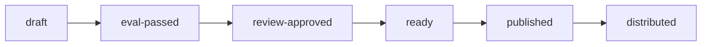
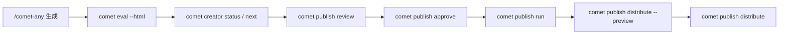

<Tip>
  这是进阶内容。`/comet-any` 会主动推进发布流程并询问你确认，普通用户不需要手工跑这些命令。这里讲的是 readiness 门禁和状态链的完整机制。
</Tip>

发布**不是**把文件复制到平台目录。Comet 要确认当前 hash 有 eval 证据、有人工批准，并且目标平台能力满足要求，才会允许发布和分发。

## 发布状态链



每个状态都有明确的门禁：

| 状态 | 含义 | 进入条件 |
| --- | --- | --- |
| `draft` | 刚生成，还没验证 | `/comet-any` 生成完成 |
| `eval-passed` | 有当前 hash 的 eval 证据 | `comet eval ... --html` 通过且 hash 匹配 |
| `review-approved` | 人工批准当前 hash | `comet publish approve` |
| `ready` | 满足所有发布门禁 | review summary 为 publishable |
| `published` | 已发布可安装候选 | `comet publish run` |
| `distributed` | 已分发到平台 | `comet publish distribute` |

还有一个异常状态 `drift-conflict`：当一个 ready 状态的 draft hash **和** ready hash 都变了，会进入冲突状态，带 `conflict: {draftHash, readyHash}`。只有其中一个变了则直接回退到 `draft`。

## readiness 结论

readiness 有四种面向用户的结论：

| 结论 | 含义 | 触发条件 |
| --- | --- | --- |
| `published` | 已发布 | status `ready` 且 hash 匹配且无 blocker |
| `can-publish` | 可以发布 | status `review-approved` 且 review 匹配 hash 且 decision approved 且无 blocker |
| `needs-confirmation` | 等待确认 | 无 blocker 但还没批准 |
| `blocked` | 不能发布 | 存在任何 blocker |

<p align="center">
  
</p>

<p align="center">发布前先确认 eval evidence 绑定当前 draft 和 manifest，再用 creator 看状态，用 publish 做评审、批准、发布和分发预览</p>

非 JSON 输出会用这些标题：`published` → "Already published"；`can-publish` → "Ready to publish"；`needs-confirmation` → "Ready for review approval"；`blocked` → "Cannot publish yet"。

## 推荐流程

`comet publish` 是普通用户面对 `/comet-any` 产物的发布入口。它只处理 eval 证据就绪后的 review、approval、publish 和 distribute。创建状态、恢复状态和唯一下一步由 `comet creator` 负责。



## 用户命令

```bash
# 查看完整 readiness 和阻塞项
comet creator status my-skill --project . --json

# 只想知道下一步该跑什么
comet creator next my-skill --project . --json

# 生成评审摘要
comet publish review my-skill --platform claude --json

# 人工批准
comet publish approve my-skill --reviewer alice --json

# 发布已批准 candidate
comet publish run my-skill --platform claude --json

# 分发预览（强制）
comet publish distribute my-skill --platform claude --scope project --preview --json

# 真实分发
comet publish distribute my-skill --platform claude --scope project --json
```

如果包含 hooks 或脚本，分发时需要确认可执行披露：

```bash
comet publish distribute my-skill --platform claude --scope project --confirm-executables --json
```

如果用户明确选择跳过 optional 能力：

```bash
comet publish distribute my-skill --platform claude --scope project --skip-capability <capability> --json
```


## status 和 next 怎么选

| 你想做什么 | 用哪个命令 | 输出重点 |
| --- | --- | --- |
| 看完整 readiness、blocker、warning 和 evidence | `comet creator status <name>` | 完整状态和恢复上下文 |
| 从中断流程恢复，只想知道现在跑什么 | `comet creator next <name>` | 单个推荐动作、命令、原因和是否需要用户确认 |

`comet creator next` 不暴露后端 Bundle 命令。它会把后端 next action 翻译成普通用户命令，例如 `comet eval ... --html`、`comet publish review ...`、`comet publish approve ...`，或提示你回到 `/comet-any` 解决候选、确认方案、重新生成。

## 阻塞码（blocker codes）

readiness blockers 会阻止 publish。每个 blocker 都有一个**前缀码**，告诉你问题出在哪。当 `Readiness: blocked` 时，按下面的表定位：

| 阻塞码 | 含义 | 恢复建议 |
| --- | --- | --- |
| `[candidate]` | 还有未解决的缺失/歧义候选 | 回到 `/comet-any` 选择来源，或让 `comet creator next` 给出恢复命令 |
| `[preference]` | （strict）required Skill 缺失/歧义；偏好漂移 | 确认偏好或重新生成 |
| `[proposal]` | proposal 未确认 | 回到 `/comet-any` 查看并确认组合方案 |
| `[composition]` | composition 有 issue（cycle、unresolved-choice 等） | 修复组合方案 |
| `[control-plane]` | 稳定控制面校验失败 | 检查 required capability set 是否完整 |
| `[authoring]` | 生成物仍有 `AUTHORING PENDING` 或 substance 节点没写完 | 完成对应 authoring lane，再记录输出 |
| `[draft]` | 缺少 `currentHash` | 重新生成 draft |
| `[eval]` | 缺少/失败/对应旧 hash 的 Eval 证据 | 重新跑 `comet eval ... --html` |
| `[agent]` | Claude Code custom agent 没出现在平台预览里 | 重新跑 Claude 平台分发预览 |
| `[publish]` | status `ready` 但没有 ready metadata | 重新走 review 流程 |

<Note>
  每个 blocker 都带 <code>nextAction: { label, command }</code>，直接给出恢复建议。想看完整上下文用 <code>comet creator status</code>；只想复制下一条用户命令时，用 <code>comet creator next</code>。
</Note>

### Warning（非阻塞）

这些不阻塞，但会在评审摘要里提示：

- `[preference]` advisory 模式下的偏好漂移
- `[review]` approval 对应旧 hash
- `[capability]` optional 能力缺口
- `[agent]` 平台 agent 预览缺失
- `[executable]` 可执行披露待确认

## 评审摘要

发布前必须先看 readiness。`comet publish review` 的评审摘要至少包含：

- Bundle 名称、版本、hash
- 多个 entry 与 internal Skill 列表
- `planHash`、`preferenceHash` 与 `reference/resolved-skills.json` 真实 Skill 证据
- 推荐调用顺序与 `preferenceIndex`
- 偏离偏好顺序的项和原因
- `.comet/skill-preferences.yaml` 是否在 Factory 初始化后发生漂移
- 稳定组合 Skill Bundle 的 required capability set 是否声明完整
- 能力缺口和可执行披露
- Eval 选择、token 消耗和结果摘要
- `Validate this Skill` 与下一步提示

非 JSON 输出也会明确展示 `Readiness:`、`Blockers:`、`Warnings:`、`Evidence:`，让你能直接看懂 readiness 为什么可发布或被阻塞。

## 分发预览是强制的

执行真实分发前，**必须先跑 preview**：

```bash
comet publish distribute my-skill --platform claude --scope project --preview --json
```

preview 是**强制检查**，不是可选附加项。它会展示：

- `Install preview`
- planned files
- unsupported capability
- executable disclosures
- `No files were written`

只有你确认 preview 结果后，才可以移除 `--preview` 执行真实分发。

## 能力缺口和可执行披露

分发前必须处理平台能力差异：

| 能力类型 | 缺口处理 |
| --- | --- |
| required 能力缺口 | **取消该平台**，不能跳过 |
| optional 能力缺口 | 必须**由你显式选择 skip**（`--skip-capability`） |
| Hook/脚本披露 | 必须**由你确认**后才可分发（`--confirm-executables`） |

`hooks/*.yaml` 是 **Comet portable hook descriptor**，只在 `comet publish distribute` 编译到目标平台配置后生效。直接把 hook 文件拷到平台目录不会生效。

## eval-record 证据契约

如果用 `comet bundle eval-record` 手工记录 eval 证据，结果 JSON 必须满足这个 schema：

```json
{
  "schemaVersion": 2,
  "provider": "comet-eval",
  "level": "quick",
  "draftHash": "<64 位 hex SHA-256>",
  "evalManifestHash": "<64 位 hex SHA-256>",
  "tasks": ["authoring-skill-smoke"],
  "treatments": ["CONTROL", "COMET_FULL"],
  "passAtK": { "authoring-skill-smoke": 1 },
  "weightedScore": { "authoring-skill-smoke": 0.92 },
  "instabilityGap": { "authoring-skill-smoke": 0 },
  "failures": [],
  "reports": ["eval/local/logs/experiments/example/summary.html"],
  "passed": true,
  "summary": "All quality gates passed."
}
```

<Warning>
  <code>draftHash</code> 必须等于当前 <code>currentHash</code>，<code>evalManifestHash</code> 必须等于当前生成的 <code>comet/eval.yaml</code> hash。旧 hash 或旧 manifest 的证据会被保留到磁盘，但不能推进 readiness。普通用户不需要手写这个文件——<code>/comet-any</code> 会通过 <code>comet eval</code> 自动产出。
</Warning>

## Bundle 和 publish 的关系

`comet creator` 是创建和恢复入口，`comet publish` 是发布入口。`comet bundle` 是高级后端，负责确定性状态、hash、readiness、publish 和 distribute。除非排障或审计，你不需要直接操作 Bundle 状态文件。

| 命令 | 定位 | 适合谁 |
| --- | --- | --- |
| `comet creator` | 创建状态和恢复入口 | 普通用户、自动化 |
| `comet publish` | 用户发布入口 | 普通用户、自动化 |
| `comet bundle` | 高级 Bundle 后端 | 审计、调试、自动化集成 |

需要排查后端状态时可以参考 [comet bundle](/zh/cli/bundle)。

## 下一步

- [comet publish 命令](/zh/cli/publish) — 完整子命令和选项参考
- [创建 Skill 的完整流程](/zh/skill-creator/workflow) — 从生成到分发的完整链路
- [评估系统概览](/zh/eval/overview) — eval 证据如何驱动 readiness
