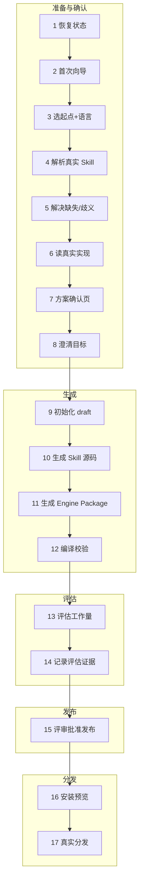

<Tip>
  创建、优化或组合 Skill 时，通常只需要在 Agent 里调用 <code>/comet-any</code> 并按提示确认。评估、发布、分发和恢复会由流程引导；除非排障或自动化集成，不需要先关心底层命令、内部状态或生成物结构。本页是进阶内容，覆盖完整流程的每一步；如果你只想快速跑通，先看[快速上手：组合任意 Skill](/zh/skill-creator/getting-started)。
</Tip>

本页列出 `/comet-any` 的阶段、状态和对应 CLI。创建入口仍是 `/comet-any`；下列命令用于查看状态、恢复或集成自动化。

## 主路径

```text
/comet-any 创建
  → comet eval --collect / --html（验证）
  → comet creator status / next（看 readiness 和唯一下一步）
  → comet publish review / approve / run（发布）
  → comet publish distribute --preview / distribute（分发）
```

如果你只是要完成一次 Skill 创建，优先按这条主线走。下面的 17 个阶段是完整参考，用来解释卡住时发生了什么、为什么要暂停、以及下一步应该看哪个命令。

| 你现在的状态 | 下一步 |
| --- | --- |
| 还没开始创建 | 在 Agent 里调用 `/comet-any` |
| 创建中断或不确定下一步 | 运行 `comet creator next <name> --project . --json` |
| 想看完整 readiness / blocker / evidence | 运行 `comet creator status <name> --project . --json` |
| 已生成 Skill，需要发布前证据 | 运行 `comet eval ./generated-skill/comet/eval.yaml --collect`，再运行 `--html` |
| 评估已通过 | 运行 `comet publish review`、`approve`、`run`、`distribute --preview` |

<Note>
  本页会出现 draft hash、eval evidence、Bundle draft 等内部术语。它们用于解释恢复和发布门禁；日常使用时优先看 <code>comet creator next</code> 给出的唯一下一步。
</Note>

## 完整阶段参考

完整流程可以分为 **17 个阶段**，下面逐个讲。为了便于理解，把它们分成五个逻辑阶段：



| 逻辑阶段 | 阶段 | 关键门禁 |
| --- | --- | --- |
| **准备与确认** | 1–8 | 方案确认页：用户确认前不写 Bundle draft |
| **生成** | 9–12 | 编译校验：产物与 `workflow-protocol.json` 一致 |
| **评估** | 13–14 | eval 证据绑定当前 draft hash，否则不推进状态 |
| **发布** | 15 | 人工显式批准后才发布 |
| **分发** | 16–17 | 强制先 preview，确认后再真实分发 |

<p align="center">
  
</p>

<p align="center">/comet-any 的主线很长，但可以折成准备确认、生成、评估、发布和分发五段来理解</p>

## 1. 恢复现有创作状态

`/comet-any` 默认**先尝试恢复**现有流程。只有你明确说"重新开始"或"放弃旧状态"时，它才会新建流程。

它会把恢复信息整理成**恢复摘要**，直接展示 `resumeSummary`、`Current step`、`Suggested user command` 和阻塞原因，省去手动检查 `.comet/bundle-authoring/` 的步骤。

如果有多个可恢复条目，`/comet-any` 会展示每个条目的名称、状态、next action 和原因，让你选择继续哪一个。

恢复时会检查这几项是否仍然有效：

- Skill Creator state 是否存在
- draft hash 是否变化
- `.comet/skill-preferences.yaml` 的 `preferenceHash` 是否变化
- resolved Skill hash 是否变化
- Eval evidence 是否仍匹配当前 hash
- approval 是否仍匹配当前 hash

<Info>
  想看后端具体返回什么字段，可以手工跑 <code>comet creator guide --project . --json</code>。它会返回 <code>preference</code>、<code>inventory</code>、<code>resumable</code>、<code>nextQuestions</code>、<code>userMessage</code>。
</Info>

## 2. 运行首次使用向导

如果是第一次使用（没有偏好、没有可恢复状态），`/comet-any` 会扫描 Comet 支持的平台 Skill inventory，按**能力分组**展示可复用能力，并询问是否保存推荐偏好。你不需要每次在输入框里重新列一长串 Skill。

## 3. 选择起点和语言

从三种起点里选一个（见[Skill Creator 概览 · 三种起点](/zh/skill-creator/overview#三种起点)），它们对应三种 **Skill Creator 意图**（`skillCreatorIntent`）：

| 起点 | `skillCreatorIntent` |
| --- | --- |
| 基于 Comet 现有 Skill 的五阶段定制 | `customize-comet` |
| 创建全新 workflow Skill | `new-skill` |
| 整理已有 Skill | `upgrade-existing` |

不管选哪种起点，`/comet-any` 最终都会把目标编译成同一种 **Workflow Contract**（`workflow.kind` 为 `comet-five-phase-overlay` 或 `workflow-kernel`）。详见[Workflow Contract](/zh/skill-creator/overview#workflow-contract-所有路径的共同模型)。

同时确认默认语言和 locales。至少记录默认 locale；多语言 Skill 需要说明哪些文件由 locale overlay 覆盖。

## 4. 读取偏好并解析真实 Skill

`/comet-any` 读取 `.comet/skill-preferences.yaml`，然后用 `find-skill` 解析本地真实 Skill。解析通过候选检查得到三类结果：

| 状态 | 含义 |
| --- | --- |
| `available` | 找到唯一来源 |
| `missing` | 完全找不到 |
| `ambiguous` | 有多个不同来源 |

<Warning>
  <code>/comet-any</code> 必须读取最终候选的 <code>SKILL.md</code>、直接 reference、rules、scripts 和 hooks，不能只按名称推断。
</Warning>

## 5. 处理缺失和歧义候选

如果候选 `missing` 或 `ambiguous`，`/comet-any` **必须暂停询问你**。它不能静默忽略缺失候选，也不能在多个来源中替你选择。

你明确选择来源后，`/comet-any` 会更新 Skill Creator metadata。你明确同意忽略缺失偏好时，它会记录原因（进入评审摘要）。如果还有 unresolved Skill candidates，`/comet-any` 不会继续生成。

后端等价命令（理解流程用，不需手动跑）：

```bash
# 指定来源解决歧义
comet creator resolve <name> --candidate <query> --source <root-or-hash> --json

# 或显式忽略缺失（必须给原因）
comet creator resolve <name> --candidate <query> --ignore-missing --reason "<reason>" --json
```

## 6. 读取真实候选实现

`/comet-any` 读取每个候选的真实实现（`SKILL.md`、references、rules、scripts、hooks），**只读不执行**，用于理解真实能力。

## 7. 生成 Skill Creator 方案并等待确认

`/comet-any` 把目标编译成 **Workflow Contract**，按偏好提出组合方案，并标注每个节点的职责、实现 Skill、Required Skill Call 和 Output Schema。这一页就是"**Skill Creator 方案确认页**"。

方案确认页至少包含这些区块：

| 区块 | 内容 |
| --- | --- |
| 你在做什么 | Skill Creator 意图、Skill 名、目标 |
| Workflow contract | `kind`（`comet-five-phase-overlay` / `workflow-kernel`）、每个节点的职责/实现 Skill/必须调用的 Skill/Output Schema、Output Schemas 列表 |
| 保留 / 新增 / 替换 / 关闭 | 对应起点的调整词汇 |
| 不能做 | 被拒绝的调整（例如 override control 节点） |
| 将生成哪些文件 | 产物清单 |
| Validate / Install / Advanced details | 校验、安装、进阶信息 |

<Info>
  必须明确告诉用户现在展示的是<strong>"Skill Creator 方案确认页"</strong>。用户确认前不会写 Bundle draft。
</Info>

你需要在确认页做**三选一**：

1. `confirm-generate` — 确认生成，随后写入 Bundle draft（仅当无 blocker 时才显示）。
2. `revise-proposal` — 修改目标、偏好、候选或 Workflow Contract 后重新 proposal。
3. `cancel` — 不写入 Bundle state。

## 8. 澄清 Skill Creator 目标

如果方案需要补充信息，`/comet-any` 会澄清：目标是什么、entry 还是 internal Skill、共享哪些资源、目标平台、是否需要 Engine。

## 9. 初始化 draft 和 Skill Creator metadata

用户确认后，`/comet-any` 调用后端初始化 draft：

```bash
# dry-run proposal，不写 Bundle state
comet creator propose <name> --file <plan.json> --json

# 写入确认后的 Factory state
comet creator init <name> --file <plan.json> --confirmed-proposal --json
```

`comet creator init` 会把规范化 plan 固化到 `.comet/bundle-factory-plans/<name>/plan.json`，并记录 `planHash` 和 `preferenceHash`。

### plan.json 结构

`plan.json` 的主输入是 `workflow`（Workflow Contract）：

```json
{
  "goal": "基于 Comet 现有 Skill 的五阶段定制，在 open 节点加入 grill-me 澄清需求。",
  "skillCreatorIntent": "customize-comet",
  "workflow": {
    "kind": "comet-five-phase-overlay",
    "name": "comet-with-grill-me",
    "goal": "在 open 节点要求调用 grill-me 澄清需求。",
    "nodes": {
      "open": {
        "requiredSkillCalls": [
          {
            "skill": "grill-me",
            "reason": "在创建 OpenSpec change 前澄清目标、边界和验收标准。"
          }
        ]
      }
    }
  },
  "engineMode": "deterministic",
  "runnerMode": "standalone"
}
```

关键字段：

| 字段 | 说明 |
| --- | --- |
| `skillCreatorIntent` | `customize-comet` / `new-skill` / `upgrade-existing`，对应三种起点；不写会按 `workflow.kind` 和 `mode` 推断 |
| `workflow.kind` | `comet-five-phase-overlay`（五阶段定制）或 `workflow-kernel`（全新工作流） |
| `workflow.nodes` | 按 Workflow Node id 覆盖或增强内置节点（`requiredSkillCalls`、`augmentations`、`implementation`、`satisfies`、`disabled`） |
| `workflow.customNodes` | `workflow-kernel` 模式声明全新节点（每个必须带 `responsibility`） |
| `workflow.outputSchemas` | `workflow-kernel` 模式声明自定义 Output Schema |
| `engineMode` | `none` / `deterministic` / `adaptive`（默认 `deterministic`） |
| `runnerMode` | `change`（绑定 OpenSpec 目录） / `standalone`（默认） |
| `mode` | `create`（默认）/ `optimize`，`optimize` 必须提供 `sourceRoot` |
| `defaultLocale` / `locales` | 默认语言和 locales |

<Warning>
  Skill Creator plan 不允许未知字段；<code>workflow</code> 必须是合法的 Workflow Contract。读取时会立刻调用 <code>normalizeWorkflowDefinition</code> 校验，不通过会直接报错（见[Skill Creator 概览 · 校验失败码](/zh/skill-creator/overview#校验失败码-validation-findings)）。
</Warning>

#### Workflow Node 操作语义

| 操作 | 含义 | 适用节点 |
| --- | --- | --- |
| `require`（默认 for requiredSkillCalls） | 要求节点内调用某 Skill，不替换实现 | 所有节点 |
| `augment`（默认 for augmentations） | 增强节点，不替换主实现 | 所有节点 |
| `override`（implementation 替换） | 替换节点实现 | 仅 producer（需 `satisfies`）；control 不可；普通模式 override control 会失败 |
| `disable` | 关闭节点 | 仅 `optional` 节点（`review`） |

## 10. 生成 Comet-native Skill 源码

`/comet-any` 通过**创作通道**（authoring lanes）组装产物。生成物包含入口 `SKILL.md`、每个 Workflow Node 对应的内部 Skill，并写入：

- `reference/workflow-protocol.json` —— **唯一运行事实源**（节点、边、Output Schema、state、evals），runtime / eval / review / readiness 全读它
- `reference/resolved-skills.json` —— 真实 Skill 来源证据 + workflow 节点绑定

<Info>
  <code>/comet-any</code> 优先使用原生的 <code>skill-creator</code>，必须在使用 Comet 兜底前征得同意。
</Info>

## 11. 生成 Engine Package

多步骤、需要恢复、需要 guardrails、需要 runtime checks 或包含脚本副作用的生成物，会生成 Engine Package。轻量单步 Skill（`engineMode: none`）可以不启用 Engine，但会失去 Run 恢复和 runtime check。

生成的 Engine 四件套：`comet/skill.yaml`、`comet/guardrails.yaml`、`comet/checks.yaml`、`comet/eval.yaml`。其中 `comet/eval.yaml` 会携带当前 draft hash 占位、推荐任务、baseline treatments、质量门禁、必需 Output Schema 和预期 evidence。Engine 机制的完整说明见[Skill 与 Engine](/zh/skill-creator/engine)。

## 12. 编译和校验

`/comet-any` 编译到参考平台并校验：

```bash
comet bundle compile <name> --platform <id> --json
```

校验包括 Workflow Contract 语义、稳定控制面（required capability set）和平台能力匹配。Workflow Contract 在生成前已经过 `normalizeWorkflowDefinition` 校验（control 节点不能 override、producer override 要 satisfy、Output Schema 要存在等），编译阶段会再次核对产物与 `workflow-protocol.json` 一致。

## 13. 展示评估工作量

`/comet-any` 展示评估工作量，让你选 `skip` / `quick` / `full`：

```bash
comet bundle eval-plan <name> --level quick --json
comet bundle eval-plan <name> --level full --json
```

返回 `level`、`components[]`、`estimatedRuns`、`tokenWorkload`、`explanation`。这是一个**描述性估算**，不是 token 承诺。

| 级别 | 覆盖范围 | 估算 |
| --- | --- | --- |
| `quick` | static、entry-smoke、baseline、assertion-grading、platform-compile | `4 + entries*2` 次 |
| `full` | quick 全部 + trigger-accuracy、routing-overlap、failure-analysis 等 | `quick + 6 + entries*3` 次 |

## 14. 记录评估证据

实际执行评估（这一步对应 `comet eval`）并把证据绑定到当前 draft hash 和当前 eval manifest hash：

```bash
# 记录 eval 证据（result JSON 必须绑定当前 draft hash 和 eval manifest hash）
comet bundle eval-record <name> --result <file> --json
```

`eval-record` 只接受 `schemaVersion: 2`、`provider: "comet-eval"` 的结果。只有 `passed: true` 且 `failures` 为空，状态才会推进到 `eval-passed`；否则回退到 `draft` 并清除 review/ready/conflict。

<Warning>
  证据 <code>draftHash</code> 不等于当前 <code>currentHash</code>，或 <code>evalManifestHash</code> 不等于当前生成的 <code>comet/eval.yaml</code> hash 时，只写文件不推进状态。旧证据可以保留在磁盘，但不能推进状态。
</Warning>

## 15. 评审、批准、发布

发布前先看 readiness 和下一步。`comet creator status` 展示完整 readiness、blocker、warning 和 evidence；`comet creator next` 只返回一条用户应该执行的下一步命令。`/comet-any` 会基于评审摘要展示 entry Skill、internal Skill、`planHash`、`preferenceHash`、真实 Skill 证据、推荐调用顺序、偏离项和原因、能力缺口、可执行披露、Eval 结果摘要，以及 `Readiness:`、`Blockers:`、`Warnings:`、`Evidence:`。

```bash
# 评审摘要
comet publish review my-skill --platform <reference-platform> --json

# 人工批准
comet publish approve my-skill --reviewer alice --json

# 发布
comet publish run my-skill --platform <reference-platform> --json
```

只有用户显式批准后，才能继续发布。阻塞项见[发布和分发 Skill](/zh/skill-creator/publishing)。

## 16. 安装预览（强制）

发布后，`/comet-any` **必须询问你是否分发**，不能自动分发。真正执行前**必须先跑 preview**：

```bash
comet publish distribute my-skill --platform <id> --scope project --preview --json
```

preview 会展示 `Install preview`、planned files、unsupported capability、executable disclosures、`No files were written`。

## 17. 真实分发

确认 preview 结果后，移除 `--preview` 执行真实分发：

```bash
comet publish distribute my-skill --platform <id> --scope project --json
```

如果目标平台包含 hook 或脚本等可执行能力，必须先展示披露信息，用户确认后才可加 `--confirm-executables`。如果用户明确选择跳过 optional 能力，才可加 `--skip-capability <capability>`。

---

## 恢复中断流程

如果做到一半中断，回来后直接对 Agent 说：

```text
继续上次的 Skill 创建
```

`/comet-any` 会先扫描可恢复状态，展示名称、状态、next action、blockers 和上次确认的组合方案摘要。恢复时的 hash 漂移处理：

| 模式 | 偏好或 Skill 来源变化时 |
| --- | --- |
| `advisory` | 给 warning，让你选择继续旧组合方案或重新生成 |
| `strict` | 阻塞，要求你确认继续或重新生成 |

---

## 完整示例：创建一个 PR 评审助手

### 1. 准备偏好（可选）

```yaml
# .comet/skill-preferences.yaml
version: 1
mode: advisory

prefer:
  - brainstorming
  - writing-plans
  - requesting-code-review
  - verification-before-completion

require:
  - requesting-code-review
  - verification-before-completion

policies:
  missing: ask
  ambiguous: ask
  deviation: explain
  scripts: disclose
  hooks: disclose
```

### 2. 调用 /comet-any 并描述目标

```text
/comet-any
```

```text
请基于项目级偏好创建一个 PR 评审助手。
它要先澄清评审范围，再制定检查计划，再执行代码审查，
最后在完成前要求验证证据。
目标是给团队复用，不只是当前一次任务。
```

### 3. 确认方案后，走评估和发布

```bash
# 评估
comet eval ./generated-skill/comet/eval.yaml --collect
comet eval ./generated-skill/comet/eval.yaml --html

# 评审、批准、发布
comet publish review review-helper --platform claude --json
comet publish approve review-helper --reviewer alice --json
comet publish run review-helper --platform claude --json

# 分发（强制预览 → 真实分发）
comet publish distribute review-helper --platform claude --scope project --preview --json
comet publish distribute review-helper --platform claude --scope project --json
```

## 常用命令

1. `/comet-any` 是创建、优化、组合 Skill 的**唯一主入口**。
2. `.comet/skill-preferences.yaml` 是项目级偏好，可以手写，也可以由 `/comet-any` 生成。
3. 生成前必须先看**组合方案**，确认后才会写 Bundle draft。
4. **Eval 是发布前证据**，不是发布动作。
5. 用 `comet creator status` 查看 readiness，用 `comet creator next` 查看建议动作；不要手工修改 Bundle 状态。

## 下一步

- [Skill 偏好与真实来源](/zh/skill-creator/preferences) — 配置 `.comet/skill-preferences.yaml`
- [发布和分发 Skill](/zh/skill-creator/publishing) — readiness、approval、publish 和 distribute
- [Skill 与 Engine](/zh/skill-creator/engine) — Engine Package 和 runtime check
- [评估系统概览](/zh/eval/overview) — eval 如何为发布提供证据
