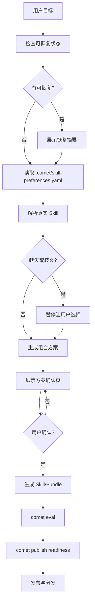

<Info>
  这是进阶内容。如果你只想快速创建一个 Skill，先看[快速上手：组合任意 Skill](/zh/skill-factory/getting-started)。
</Info>

`/comet-any` 是 Comet 的 Skill Factory。你描述想要的工作流，它读取真实本地 Skill、生成可验证、可评审、可分发的 Skill 或 Bundle。对普通用户，它隐藏了 Bundle、Factory、composition、Phase Recipe 这些后端概念。

## 用户只需要记住的主线

```text
/comet-any -> comet eval -> comet publish
```

展开后的推荐链路是：

```text
/comet-any 创建 -> comet eval 验证 -> comet publish review/approve/run -> comet publish distribute --preview -> comet publish distribute
```

`comet bundle` 是高级 Bundle 后端，负责确定性状态、hash、readiness、publish 和 distribute；`comet skill` 是底层 Skill 工具，适合本地调试和 Engine Run。它们都不是普通用户创建 Skill 的主入口。

## 三种起点

普通用户第一层只需要从三种起点里选一个：

| 起点 | 含义 | 边界 |
| --- | --- | --- |
| 改一版 `/comet` | 在 `/comet` 受保护边界内做增量调整 | 只能增加 Skill、替换 Skill、关闭 Skill |
| 做一个新 Skill | 从目标描述创建新的 Comet-native Skill | 自由组合 |
| 整理已有 Skill | 读取现有 Skill 或候选 Skill，整理成新 Skill | 以已有内容为来源 |

<Warning>
  当你选择"改一版 `/comet`"时，必须把 `/comet` 视为受保护边界：`open / design / build / verify / archive` 和 `.comet.yaml` 状态机不能被改写，允许修改的只有"增加 Skill、替换 Skill、关闭 Skill"。
</Warning>

## `/comet-any` 做什么

- 先尝试恢复现有创作状态，而不是直接新建。
- 读取 `.comet/skill-preferences.yaml` 里的偏好顺序（advisory / strict 模式）。
- 用 `find-skill` 解析本地真实 Skill 内容，而不是只按名字猜测。
- 处理缺失或歧义候选，必须暂停询问用户。
- 生成组合后的调用链。
- 先展示"Skill Maker 方案确认页"，用户确认后才写 Bundle draft。
- 写入 `reference/resolved-skills.json` 作为真实来源证据。
- 为多步骤 Skill 生成 Engine metadata。
- 生成 `comet/eval.yaml`。
- 进入 readiness、review、approval、publish 和 distribute。



## 什么时候用

- 你想把团队流程做成可复用 Skill。
- 你想优化已有 Skill，使其可评估、可发布。
- 你想组合多个 Skill，并保留真实来源证据。
- 你想把生成物分发到 Claude Code、Codex 等平台。
- 你想在 `/comet` 五阶段基础上增加、替换或关闭某些 Skill。

## `/comet-any` 的产出

一次完整生成或优化后，产物应包含：

```text
<bundle-draft>/
  bundle.yaml
  skills/<entry-skill>/
    SKILL.md
    comet/
      skill.yaml
      guardrails.yaml
      checks.yaml
      eval.yaml
    reference/
      resolved-skills.json
      composition-report.md
    scripts/
  rules/
  hooks/
```

关键文件：

| 文件 | 作用 |
| --- | --- |
| `SKILL.md` | 用户真正调用的入口 |
| `reference/resolved-skills.json` | 真实 Skill 来源、hash、摘要、选择原因和偏好证据 |
| `reference/composition-report.md` | 组合方案、偏离解释、风险和 review evidence |
| `comet/skill.yaml` | 内部运行计划，不是用户手写入口 |
| `comet/guardrails.yaml` | 由偏好和风险策略生成的约束 |
| `comet/checks.yaml` | 运行完成度和 required Skill 检查 |
| `comet/eval.yaml` | Eval manifest |
| `scripts/`、`rules/`、`hooks/` | 稳定推进流程的 required control plane |

稳定组合 Skill Bundle 的 required capability set（必需能力集合）是 `skills/scripts/rules/hooks/references`，其中 `scripts/rules/hooks` 是 required control plane，不能当作可随意删除的附属文件；`hooks/*.yaml` 是 Comet portable hook descriptor，只有通过 `comet publish distribute` 编译到目标平台配置后才会生效。

<Warning>
  `/comet-any` 不应把手动 `comet bundle` 命令当成用户主流程。Bundle 是确定性后端，由 `/comet-any` 在内部调用。
</Warning>

## 下一步

- [创建 Skill 的完整流程](/zh/skill-factory/workflow) — 从准备偏好到生成、评估、发布、分发
- [Skill 偏好与真实来源](/zh/skill-factory/preferences) — 配置 `.comet/skill-preferences.yaml`
- [发布和分发 Skill](/zh/skill-factory/publishing) — readiness、approval、publish 和 distribute
- [评估系统概览](/zh/eval/overview) — eval 如何为发布提供证据
