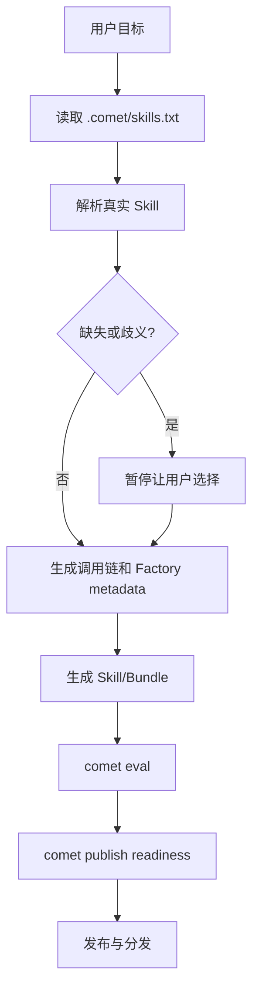

`/comet-any` 是 Comet Skill Factory。你描述想要的工作流，它读取真实本地 Skill，生成可验证、可评审、可分发的 Skill 或 Bundle。

## 用户只需要记住的主线

```text
/comet-any -> comet eval -> comet publish
```

## `/comet-any` 做什么

- 读取 `.comet/skills.txt` 里的偏好顺序。
- 解析本地真实 Skill 内容，而不是只按名字猜测。
- 处理缺失或歧义候选。
- 生成组合后的调用链。
- 写入 `reference/resolved-skills.json` 作为证据。
- 为多步骤 Skill 生成 Engine metadata。
- 生成 `comet/eval.yaml`。
- 进入 readiness、review、approval、publish 和 distribute。



## 什么时候用

- 你想把团队流程做成 Skill。
- 你想优化已有 Skill，使其可评估、可发布。
- 你想组合多个 Skill，并保留真实来源证据。
- 你想把生成物分发到 Claude Code、Codex 等平台。

<Warning>
  `/comet-any` 不应把手动 `comet bundle` 命令当成用户主流程。Bundle 是确定性后端。
</Warning>
