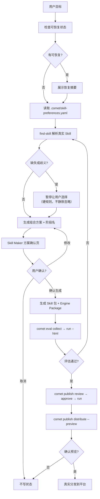

<Info>
  这是进阶内容。如果你只想快速创建一个 Skill，先看[快速上手：组合任意 Skill](/zh/skill-factory/getting-started)。
</Info>

`/comet-any`（也叫 **Skill Maker**）是 Comet 的 Skill Factory。你描述想要的工作流，它读取真实本地 Skill、生成**可验证、可评审、可分发**的 Skill 或 Bundle，并把后端复杂度（Bundle、Factory、composition、Phase Recipe、resolved-skills）隐藏在内部。

## 核心设计原则

理解 `/comet-any` 的关键是一个**两层分离**：

| 层 | 内容 | 谁会接触 |
| --- | --- | --- |
| **用户层** | 三种起点 + `增加 Skill / 替换 Skill / 关闭 Skill` 的调整词汇 | 所有用户 |
| **内部层** | Bundle、Factory、composition、template delta、resolved-skills.json | 仅审计/排障时查看 |

**用户唯一需要记住的入口是 `/comet-any`**。CLI（`comet bundle`、`comet publish`）是它的确定性后端，普通用户不需要手动操作。

## 主线

```text
/comet-any 创建  →  comet eval 验证  →  comet publish 发布和分发
```

展开后的完整链路：

```text
/comet-any 创建
  → comet eval collect / run（验证）
  → comet publish review / approve / run（发布）
  → comet publish distribute --preview（强制预览）
  → comet publish distribute（真实分发）
```

`comet bundle` 是高级 Bundle 后端，负责确定性状态、hash、readiness、publish 和 distribute；`comet skill` 是底层 Skill 工具，适合本地调试和 Engine Run。它们都**不是**普通用户创建 Skill 的主入口。

## 三种起点

用户第一层只需要从三种起点里选一个。它们对应后端三种 `mode`：

| 起点（用户层） | 后端 mode | 含义 | 必须提供 |
| --- | --- | --- | --- |
| **改一版 `/comet`** | `derive` | 在 `/comet` 受保护边界内做增量调整 | `baseTemplate` + `templateDelta` |
| **做一个新 Skill** | `create`（默认） | 从目标描述创建新的 Comet-native Skill | `goal` |
| **整理已有 Skill** | `optimize` | 读取现有 Skill 整理成可发布 Skill | `sourceRoot` |

### 受保护边界：改一版 /comet

当你选择"改一版 `/comet`"时，`/comet` 被视为**受保护边界**。这五个阶段硬编码在协议里，不可改写：

```text
open → design → build → verify → archive
```

允许的调整**只有三种**：

| 调整词汇 | 后端动作 | 限制 |
| --- | --- | --- |
| **增加 Skill** | `templateDelta.add` | 在某个阶段的 `before`/`after` 插入 |
| **替换 Skill** | `templateDelta.replace` | 只能替换 `mutable` 步骤 |
| **关闭 Skill** | `templateDelta.disable` | 只能关闭 `optional` 步骤 |

`/comet` 的 Skill Maker 模板把这五个阶段拆成 7 个步骤，每个步骤标记为 `protected`（受保护）、`mutable`（可替换）或 `optional`（可关闭）：

| 阶段 / 步骤 | Skill | 类型 |
| --- | --- | --- |
| `open/open` | `comet-open` | protected |
| `design/brainstorming` | `comet-design` | mutable |
| `build/writing-plans` | `writing-plans` | mutable |
| `build/build-execution` | `comet-build` | mutable |
| `build/build-review` | `requesting-code-review` | optional |
| `verify/verify-result-transition` | `comet-verify` | protected |
| `archive/archive-delta-sync` | `comet-archive` | protected |

还有两种**预设 profile**：`hotfix`（去掉 design）、`tweak`（去掉 design 和 writing-plans）。

<Warning>
  评审阶段会硬阻塞任何<strong>缺少五阶段</strong>的生成请求（finding code：<code>missing-comet-phase</code>）。<code>protected</code> 步骤不能被替换，<code>disable</code> 只作用于 <code>optional</code> 步骤。
</Warning>

## /comet-any 做什么

一次完整的 `/comet-any` 调用会按顺序做这些事：

1. **先尝试恢复**现有创作状态，而不是直接新建。
2. 读取 `.comet/skill-preferences.yaml` 里的偏好顺序（`advisory` / `strict` 模式）。
3. 用 `find-skill` **解析真实 Skill 内容**（读 `SKILL.md`、references、rules、scripts、hooks），而不是只按名字猜测。
4. 处理**缺失或歧义**候选，必须暂停询问用户。
5. 生成组合方案和**阶段名**（stage names）。
6. 先展示 **Skill Maker 方案确认页**，用户确认后才写 draft。
7. 写入 `reference/resolved-skills.json` 作为**真实来源证据**（含 `sourceSummaries`）。
8. 为多步骤 Skill 生成 **Engine Package**（`skill.yaml`、`guardrails.yaml`、`checks.yaml`、`eval.yaml`）。
9. 生成 `comet/eval.yaml` 评估清单。
10. 进入 readiness、review、approval、publish 和 distribute。



## 什么时候用 /comet-any

- 想把团队流程做成**可复用 Skill**。
- 想优化已有 Skill，使其可评估、可发布。
- 想组合多个 Skill，并**保留真实来源证据**。
- 想把生成物**分发到 Claude Code、Codex 等平台**。
- 想在 `/comet` 五阶段基础上**增加、替换或关闭**某些 Skill。

## /comet-any 的产出

一次完整生成或优化后，产物包含：

```text
<bundle-draft>/
  bundle.yaml                         # Bundle 清单
  skills/<entry-skill>/
    SKILL.md                          # 用户真正调用的入口
    comet/
      skill.yaml                      # Engine 运行计划
      guardrails.yaml                 # 运行时约束
      checks.yaml                     # runtime eval（运行期）
      eval.yaml                       # 创建期评估 manifest（发布前证据）
    reference/
      resolved-skills.json            # 真实 Skill 来源证据
      composition-report.md           # 组合方案和偏离解释
      workflow-protocol.json          # 工作流协议
      decision-points.md              # 决策点
      recovery.md                     # 恢复路径
      skill-review.md                 # 作者自审
      authoring-lanes.json            # 创作车道记录
    scripts/                          # required control plane
      workflow-state.mjs
      workflow-guard.mjs
      workflow-handoff.mjs
  rules/                              # required control plane
  hooks/                              # required control plane（portable hook descriptor）
```

### 关键文件职责

| 文件 | 生命周期 | 职责 |
| --- | --- | --- |
| `SKILL.md` | 创建期 + 运行期 | 用户真正调用的入口 |
| `reference/resolved-skills.json` | 创建期 | 真实 Skill 来源、hash、`sourceSummaries`、选择原因和偏好证据 |
| `reference/composition-report.md` | 创建期 | 组合方案、偏离解释、风险和 review evidence |
| `comet/skill.yaml` | 运行期 | 内部运行计划（goal、orchestration、steps），不是用户手写入口 |
| `comet/guardrails.yaml` | 运行期 | 由偏好和风险策略生成的约束（允许列表、预算） |
| `comet/checks.yaml` | 运行期 | runtime evals（progress/step/completion） |
| `comet/eval.yaml` | 创建期 | Eval manifest（`comet eval` 的输入） |

<Note>
  <strong>容易混淆的命名：</strong>复数 <code>evals.yaml</code>（或 <code>checks.yaml</code>）是<strong>运行期</strong> eval，由 Engine 在运行时检查；单数 <code>eval.yaml</code> 是<strong>创建期</strong>评估 manifest，由 <code>comet eval</code> 在发布前验证。两者生命周期不同，不能混为一谈。
</Note>

### 必需能力集合（required capability set）

稳定组合 Skill Bundle 的 required capability set 是 `skills / scripts / rules / hooks / references`：

- `skills`：入口 Skill 和各阶段内部 Skill。
- `scripts / rules / hooks`：**required control plane**，不是可随意删除的附属文件。它们负责状态推进、守卫、移交的确定性。
- `references`：真实来源证据和创作审计。

`hooks/*.yaml` 是 **Comet portable hook descriptor**，只有通过 `comet publish distribute` 编译到目标平台配置后才会生效。

<Warning>
  <code>/comet-any</code> 不应把手动 <code>comet bundle</code> 命令当成用户主流程。Bundle 是确定性后端，由 <code>/comet-any</code> 在内部调用。
</Warning>

## 硬规则（hard gates）

`/comet-any` 有几条不可妥协的硬规则，理解它们能避免踩坑：

- **用户只调用这个 Skill**，CLI 是内部后端。
- 必须**用 `find-skill` 解析真实 Skill**，不能只按名字推测能力。
- **缺失/歧义候选必须暂停**询问用户，绝不静默忽略或替用户选择。
- `factory-generate` 遇到未解决候选会 **fail closed**。
- **Eval 被跳过或失败** → 永远不进入 ready，永远不生成安装候选。
- **缺少人工批准** → 永远不 ready。
- **分发前必须先 preview**，用户确认后才写入。
- 非 JSON 输出必须显式展示 `Readiness:`、`Blockers:`、`Warnings:`、`Evidence:` 和 `Validate this Skill`。

## 下一步

- [创建 Skill 的完整流程](/zh/skill-factory/workflow) — 从准备偏好到生成、评估、发布、分发
- [Skill 偏好与真实来源](/zh/skill-factory/preferences) — 配置 `.comet/skill-preferences.yaml`
- [发布和分发 Skill](/zh/skill-factory/publishing) — readiness、approval、publish 和 distribute
- [Skill 与 Engine](/zh/skill-factory/engine) — Skill 包结构和 Engine 运行时
- [评估系统概览](/zh/eval/overview) — eval 如何为发布提供证据
