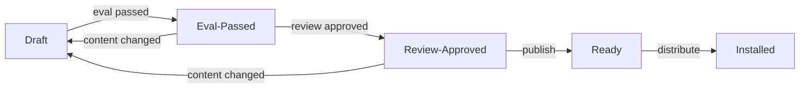

Skill Factory 生成的 Skill 包需要经过评估、审查、发布和分发四个阶段才能在 AI 编程平台中使用。

## 发布生命周期



### 状态说明

| 状态 | 含义 |
|---|---|
| `draft` | 初始状态，内容可能不完整 |
| `eval-passed` | 已通过评估 |
| `review-approved` | 已通过人工审查 |
| `ready` | 已发布到 `.comet/bundles` |
| `drift-conflict` | 内容已变更，之前的评估/审查失效 |

## 发布流程

### 1. 检查就绪状态

```bash
comet publish status my-workflow
```

输出会显示当前状态和下一步操作。

### 2. 构建审查摘要

```bash
comet publish review my-workflow --platform claude-code
```

审查摘要包含：
- 入口 Skill 和内部 Skill 列表
- Plan hash 和评估证据
- 调用链顺序和偏差说明
- 平台能力差距
- 可执行文件披露
- 评估结果
- 就绪状态（Ready / Blocked / Warning）

### 3. 批准发布

```bash
comet publish approve my-workflow --reviewer "your-name"
```

### 4. 执行发布

```bash
comet publish run my-workflow --platform claude-code
```

发布后，Skill 包会被复制到 `.comet/bundles/my-workflow/`。

### 5. 分发到平台

```bash
comet publish distribute my-workflow --platform claude-code --platform cursor
```

## 平台能力

不同 AI 编程平台支持的能力不同。Skill 在编译时会检查目标平台的能力差距。

### 能力类型

| 能力 | 说明 |
|---|---|
| `skills` | Skill 文件支持 |
| `rules` | Rules 文件支持 |
| `hooks` | Hooks 支持 |
| `scripts` | Scripts 支持 |
| `references` | References 支持 |
| `assets` | Assets 支持 |

### 能力差距处理

| 差距类型 | 处理方式 |
|---|---|
| 必需能力缺失 | 阻塞该平台的分发 |
| 可选能力缺失 | 警告，可选择跳过 |

```bash
# 跳过不支持的可选能力
comet publish distribute my-workflow --platform some-platform --skip-capability hooks
```

## 可执行文件披露

如果 Skill 包含 scripts 或 hooks，发布前必须确认其安全性。

```
Executable disclosures:

  Scripts:
    - preprocess.sh (write side effect)
      Destination: .claude/scripts/preprocess.sh
      
  Hooks:
    - post-write.sh (after_write event)
      Matcher: *.md
      Failure mode: warn
```

使用 `--confirm-executables` 明确确认：

```bash
comet publish distribute my-workflow --platform claude-code --confirm-executables
```

## Bundle 结构

发布后的 Bundle 存储在 `.comet/bundles/<name>/`：

```
.comet/bundles/my-workflow/
├── SKILL.md                    # 入口 Skill 文档
├── reference/
│   └── resolved-skills.json    # 解析证据
├── comet/
│   ├── skill.yaml              # Engine 定义
│   ├── guardrails.yaml         # 安全约束
│   ├── evals.yaml              # 运行时评估
│   └── eval.yaml               # 评估 manifest
├── rules/
│   └── my-rules.md             # Rules 文件
├── hooks/
│   └── post-write.sh           # Hooks 文件
└── scripts/
    └── preprocess.sh           # Scripts 文件
```

## 多 Locale 支持

Bundle 支持多语言版本。创建 draft 时可以指定 locale：

```bash
comet bundle draft create my-workflow --default-locale en --locale-option zh
```

分发时指定目标 locale：

```bash
comet publish distribute my-workflow --platform claude-code --locale zh
```

## 恢复中断的发布

如果发布流程中断，可以随时恢复：

```bash
# 查看可恢复的状态
comet publish list

# 恢复特定 Bundle
comet publish status my-workflow
```

Skill Factory 会自动检测并恢复到中断点。

## 最佳实践

<AccordionGroup>
  <Accordion title="始终运行评估">
    评估是确保 Skill 质量的关键步骤。不要跳过评估直接发布。
  </Accordion>

  <Accordion title="审查摘要">
    发布前仔细审查摘要，确认调用链顺序、偏差原因和能力差距。
  </Accordion>

  <Accordion title="测试分发">
    先分发到一个平台测试，确认无误后再分发到其他平台。
  </Accordion>

  <Accordion title="版本管理">
    更新 Skill 后重新走发布流程，确保版本号和 hash 正确更新。
  </Accordion>
</AccordionGroup>
