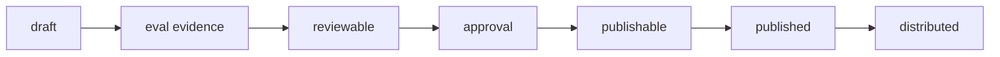
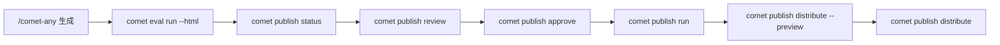

<Info>
  这是进阶内容。`/comet-any` 会主动推进发布流程并询问你确认，普通用户不需要手工跑这些命令。这里讲的是 readiness 门禁和状态链的完整机制。
</Info>

发布不是把文件复制到平台目录。Comet 要确认当前 hash 有 eval 证据、有人工批准，并且目标平台能力满足要求，才会允许发布和分发。

## 发布状态链



每个状态都有明确的门禁：

| 状态 | 含义 | 进入条件 |
| --- | --- | --- |
| `draft` | 刚生成，还没验证 | `/comet-any` 生成完成 |
| `eval evidence` | 有当前 hash 的 eval 证据 | `comet eval run --html` 通过 |
| `reviewable` | 可以评审 | eval 证据绑定当前 hash |
| `approval` | 人工批准当前 hash | `comet publish approve` |
| `publishable` | 满足发布门禁 | review summary 为 publishable |
| `published` | 已发布可安装候选 | `comet publish run` |
| `distributed` | 已分发到平台 | `comet publish distribute` |

## 推荐流程

`comet publish` 是普通用户面对 `/comet-any` 产物的发布入口。它复用 Bundle 后端，但把命令组织成 readiness、review、approval、publish 和 distribute。



## 用户命令

```bash
comet publish list --project . --json
comet publish status my-skill --project . --json
comet publish review my-skill --platform claude --json
comet publish approve my-skill --reviewer alice --json
comet publish run my-skill --platform claude --json
comet publish distribute my-skill --platform claude --scope project --preview --json
comet publish distribute my-skill --platform claude --scope project --json
```

如果包含 hooks 或脚本，分发时需要确认可执行披露：

```bash
comet publish distribute my-skill --platform claude --scope project --confirm-executables
```

如果用户明确选择跳过 optional 能力：

```bash
comet publish distribute my-skill --platform claude --scope project --skip-capability <capability>
```

## 评审摘要

发布前必须先看 readiness。`comet publish review` 的评审摘要至少包含：

- Bundle 名称、版本、hash。
- 多个 entry 与 internal Skill 列表。
- `planHash`、`preferenceHash` 与 `reference/resolved-skills.json` 真实 Skill 证据。
- 推荐调用顺序与 `preferenceIndex`。
- 偏离偏好顺序的项和原因。
- `.comet/skill-preferences.yaml` 是否在 Factory 初始化后发生漂移。
- 稳定组合 Skill Bundle 的 required capability set 是否声明完整。
- 能力缺口和可执行披露。
- Eval 选择、token 消耗和结果摘要。
- `Validate this Skill` 与下一步提示。

非 JSON 输出也会明确展示 `Readiness:`、`Blockers:`、`Warnings:`、`Evidence:`，让你能直接看懂 readiness 为什么可发布或被阻塞。

## 阻塞发布的原因

readiness blockers 会阻止 publish。只要存在以下任一项，就必须停在评审阶段，不能继续发布：

- unresolved candidate（还有未解决的候选）
- required Skill 缺失或歧义
- strict 模式下偏好文件漂移
- 缺少当前 hash 的 Eval 证据
- 缺少当前 hash 的人工 approval
- required capability gap
- executable disclosure 未确认
- review summary 不是 publishable

<Tip>
  当 `Readiness: blocked` 时，先根据 blockers 处理候选恢复、Eval 或 review，再继续 publish。
</Tip>

## 分发预览是强制的

执行真实分发前，必须先跑 preview：

```bash
comet publish distribute my-skill --platform claude --scope project --preview --json
```

preview 是强制检查，不是可选附加项。它会展示：

- `Install preview`
- planned files
- unsupported capability
- executable disclosures
- `No files were written`

只有你确认 preview 结果后，才可以移除 `--preview` 执行真实分发。

## 能力缺口和可执行披露

分发前必须处理平台能力差异：

- required 能力缺口：取消该平台。
- optional 能力缺口：必须由你显式选择 skip。
- Hook/脚本披露：必须由你确认后才可分发。

`hooks/*.yaml` 是 Comet portable hook descriptor，只在 `comet publish distribute` 编译到目标平台配置后生效。

## Bundle 和 publish 的关系

`comet publish` 是用户入口。`comet bundle` 是高级后端，负责确定性状态、hash、readiness、publish 和 distribute。除非排障或审计，你不需要直接操作 Bundle 状态文件。

需要排查后端状态时可以参考 [comet bundle](/zh/cli/bundle)。

## 下一步

- [comet publish 命令](/zh/cli/publish) — 完整子命令和选项参考
- [创建 Skill 的完整流程](/zh/skill-factory/workflow) — 从生成到分发的完整链路
- [评估系统概览](/zh/eval/overview) — eval 证据如何驱动 readiness
