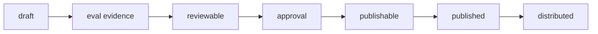

发布不是把文件复制到平台目录。Comet 要确认当前 hash 有 eval 证据、有人工批准，并且目标平台能力满足要求。

## 发布状态链



## 用户命令

```bash
comet publish status my-skill
comet publish review my-skill --platform claude
comet publish approve my-skill --reviewer alice
comet publish run my-skill --platform claude
comet publish distribute my-skill --platform claude --scope project
```

如果包含 hooks 或脚本：

```bash
comet publish distribute my-skill --platform claude --scope project --confirm-executables
```

## 阻塞发布的原因

- 还有 unresolved candidate。
- Eval 没跑。
- Eval 对应旧 hash。
- 没有人工 approval。
- required capability gap。
- executable disclosure 未确认。

## Bundle 和 publish 的关系

`comet publish` 是用户入口。`comet bundle` 是高级后端。除非排障或审计，不需要直接操作 Bundle 状态文件。
