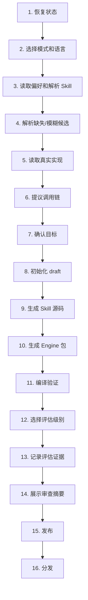

`/comet-any` 的 Skill Factory 工作流包含 16 个步骤，从恢复已有状态到最终分发。整个流程可中断恢复，每一步都有明确的输入输出。

## 工作流总览



## 步骤详解

### 1. 恢复已有状态

如果未指定 `<name>`，运行 `comet publish list --json` 查找可恢复的状态。显示名称、状态、下一步操作和原因。

```
Publish candidates:

  1. my-workflow
     Status: draft
     Next: resolve-candidates
     Reason: missing candidate: data-reader

? Resume existing or create new? (Use arrow keys)
  ◉ Resume my-workflow
  ○ Create new
```

### 2. 选择模式和语言 {#mode}

| 模式 | 说明 |
|---|---|
| `create` | 从目标描述创建全新 Skill |
| `optimize` | 读取已有 Skill 并改进 |

确认默认语言和 locale。

### 3. 读取偏好和解析 Skill

读取 `.comet/skills.txt` 中的偏好列表，运行 `comet bundle candidates --json`，然后通过 `find-skill` 解析每个候选项的真实源内容。

<Warning>
  Skill 从不从名称推断能力。每个候选项都必须有真实的 `SKILL.md` 内容作为证据。
</Warning>

### 4. 解析缺失/模糊候选

如果某个候选项缺失或有多个匹配，会暂停并请求用户输入。

```
Missing candidates:
  - data-reader: not found in any skills directory

Ambiguous candidates:
  - api-handler: found in 2 locations
    1. .claude/skills/api-handler (project)
    2. ~/.cursor/skills/api-handler (global)

? Select source for api-handler: (Use arrow keys)
  ◉ .claude/skills/api-handler (project)
  ○ ~/.cursor/skills/api-handler (global)
```

解析结果通过 `comet bundle factory-resolve` 记录。

### 5. 读取真实实现

读取每个候选的 `SKILL.md`、引用的 references、rules、scripts 和 hooks。**不会执行**任何候选脚本。

### 6. 提议默认调用链

以 `.comet/skills.txt` 的行顺序为基准，为每个 Skill 记录 `preferenceIndex`。如有偏差，必须解释原因。

```
Proposed call chain:
  1. data-reader (preference: 0)
  2. data-transformer (preference: 1)
  3. data-writer (preference: 2)

No deviations from preferences.
```

### 7. 确认 Skill Factory 目标

确认以下内容：
- 目标和场景
- 成功标准
- 入口 Skill vs 内部 Skill
- 共享资源和安全边界
- 平台能力要求
- 是否需要 Engine

### 8. 初始化 draft 和 factory 元数据

运行 `comet bundle factory-init <name> --file <plan.json>`，创建 draft 并持久化计划。

```
Created Bundle draft my-workflow
Draft: .comet/bundle-authoring/my-workflow.json
Plan: .comet/bundle-factory-plans/my-workflow.json
Plan hash: a1b2c3d4
```

### 9. 生成 Skill 源码

使用原生 `skill-creator`（或经确认后使用 fallback）生成：
- 入口 Skill
- 内部 Skill
- References
- Scripts

写入 `reference/resolved-skills.json` 作为证据。

### 10. 生成 Engine 包

对于多步骤/高风险工作流，生成：

| 文件 | 用途 |
|---|---|
| `comet/skill.yaml` | Skill 定义（编排、步骤、guardrails） |
| `comet/guardrails.yaml` | 安全约束（允许的 skills/agents/tools） |
| `comet/evals.yaml` | 运行时评估定义 |
| `comet/eval.yaml` | 评估 manifest |

同时写入 `authoring-skill-smoke` 快速评估。

### 11. 编译验证

运行 `comet bundle compile <name> --platform <id>`，验证安装计划。

```
Compiled my-workflow for claude-code: 12 file(s)

Capability gaps:
  - hooks: not supported (optional)
  - scripts: supported

Executable disclosures:
  - preprocess.sh: write side effect -> .claude/scripts/
```

### 12. 选择评估级别

展示评估工作量并让用户选择：

```
Eval workload:

  Quick (1 run, ~3000 tokens):
    - authoring-skill-smoke
    
  Full (5 runs, ~15000 tokens):
    - authoring-skill-smoke
    - generic-skill-smoke
    - comet-full-workflow

? Select eval level: (Use arrow keys)
  ◉ Quick
  ○ Full
  ○ Skip
```

<Warning>
  如果选择 Skip，不会进入 ready、publish 或 distribute 状态。
</Warning>

### 13. 记录评估证据

调用 Eval provider，产生结构化结果，运行 `comet bundle eval-record`。如果评估失败或 hash 不匹配，返回 draft 修复。

### 14. 展示审查摘要

运行 `comet publish review`，展示：
- 入口 Skill 和内部 Skill
- Plan hash 和证据
- 调用链顺序和偏差
- 能力差距和可执行文件披露
- 评估结果
- 就绪状态

**必须获得明确批准才能继续。**

### 15. 发布

只有当前 hash 通过评估并获得人工批准后，才能执行：

```bash
comet publish run <name> --platform <reference-platform>
```

### 16. 分发

**永远不自动分发。** 展示差距和披露，确认 hooks/scripts 后：

```bash
comet publish distribute <name> --platform claude-code
```

## 创建 vs 优化 {#optimize}

| 方面 | Create | Optimize |
|---|---|---|
| 输入 | 目标描述 | 已有 Skill 路径 |
| 步骤 2 | 选择 create | 选择 optimize |
| 步骤 3 | 从偏好解析 | 读取目标 Skill 内容 |
| 步骤 5 | 读取候选实现 | 读取目标 + 候选实现 |
| 步骤 9 | 从零生成 | 基于现有改进 |
| 输出 | 全新 Skill | 优化版 Skill |

## 硬性规则

Skill Factory 遵循以下不可违反的规则：

1. 用户只通过 `/comet-any` 交互
2. 必须使用 `find-skill` 解析真实 Skill
3. `.comet/skills.txt` 的行顺序是推荐调用顺序
4. 缺失/模糊候选必须暂停等待用户输入
5. 必须使用 `comet bundle` CLI 维护状态
6. 评估前必须展示工作量
7. 评估跳过或失败则不进入发布
8. 非 JSON 输出必须显示就绪状态、阻塞项、警告和证据
9. 发布前必须读取审查摘要的就绪状态
10. 发布必须人工批准，分发必须询问用户
