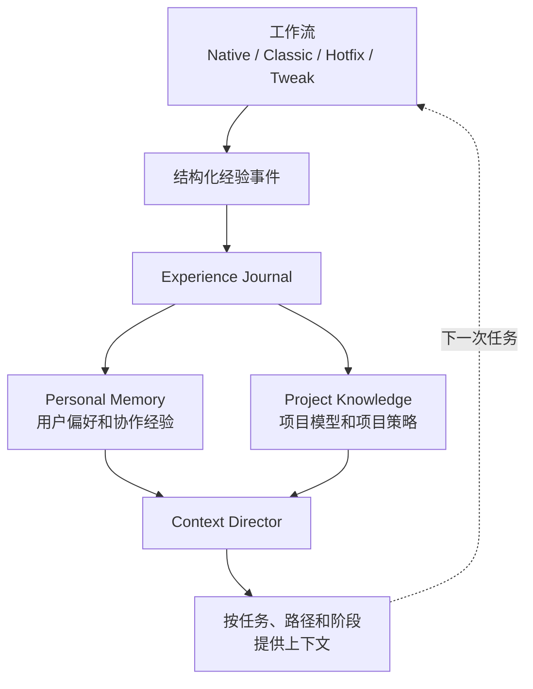

0.4.0-rc.1 的变化集中在三个方向：让工作经验可以被管理，让项目知识可以被核对，让大型 Native 需求可以由多个独立会话协作完成。它们都沿用同一个原则：用户可读内容、机器运行状态和可验证证据分别承担不同职责。

这不是一次命令名称调整。升级后，用户会在 Dashboard 看到新的插件中心，也会在 Native 大型需求中看到父 Change、child、worktree 和最终集成状态。普通工作流仍然从已有的 `/comet` 或 `/comet-native` 入口开始。

## 主要变化

| 主题                               | 用户可感知的变化                                                                                | 详细文章                                               |
| ---------------------------------- | ----------------------------------------------------------------------------------------------- | ------------------------------------------------------ |
| Agent Learning Loop                | 用户信号、验证和 Review 结果可以形成受控的可复用经验；后台整理失败不阻塞任务                    | [Agent Learning Loop](/zh/plugins/agent-learning-loop) |
| Personal Memory                    | 用户可以查看、纠正、遗忘和回滚个人偏好；相关内容按任务逐步注入                                  | [个人记忆](/zh/plugins/personal-memory)                |
| Project Knowledge / Project Policy | Agent 可以检索项目结构、决策、流程和约束，来源变化会使旧记录失效                                | [项目规则](/zh/plugins/project-rules)                  |
| Dashboard 插件中心                 | 个人记忆和项目知识拥有独立的状态、来源、应用记录和生命周期操作                                  | [Dashboard 概览](/zh/dashboard/overview)               |
| Native Supervisor Change           | 大型目标可以拆成有依赖的 child，在独立 worktree 中执行并在父 Change 上最终验收                  | [Supervisor Change](/zh/native/supervisor-change)      |
| Native Portable State              | 阶段、验收、handoff、检查、恢复和 Supervisor 摘要保存在可读状态中，机器执行状态留在本机 Runtime | [产物与状态](/zh/native/artifacts-and-state)           |
| CodeGraph 与平台支持               | Native 初始化可以选择 CodeGraph；DeepSeek Harness 和 Oh My Pi 进入安装、更新、诊断和卸载流程    | [平台支持](/zh/platforms)                              |

## 从一次任务看 rc1 的工作方式

工作流不会把所有历史内容一次性放进 Agent Context。个人记忆和项目知识先根据作用范围、当前任务、路径、操作和阶段筛选；少量高相关内容可以直接注入，较长或较低优先级的内容进入 Context Manifest，Agent 需要时再按稳定 ID 展开。

## 用户最容易注意到的变化

### Dashboard 有了插件中心

Dashboard 不再只显示 Change 和工作流产物。插件中心把个人记忆和项目知识放在独立工作区中，分别展示记录、来源、状态、应用历史、诊断和设置。页面优先展示缓存快照，后台刷新不会让首屏等待索引或 Reflection。

插件的停用、恢复和卸载有明确范围。停用个人记忆不会删除记录；暂停项目知识只影响当前项目的检索；卸载插件也不会删除项目文档或个人数据。重新启用后，插件按照当前配置继续工作。

### 个人信息和项目信息不再混在一起

个人记忆保存用户的语言偏好、沟通方式和个人协作经验。项目知识保存项目结构、依赖、决策、流程、约束和已经复验的失败解决方式。个人记忆不会自动成为团队规则，项目规则也不会覆盖当前用户要求和仓库现有规则。

### 大型 Native 需求可以分开完成

Supervisor Change 在 Shape 阶段确认拆分，Runtime 决定哪些 child 已经 ready，独立会话只处理自己的 Child Worktree。父 Change 负责按顺序集成并执行最终 Verify。Codex 可以使用独立项目任务；Claude Code 可以在启用 Agent Teams 的交互式会话中使用 teammate。用户只选择一次多会话或单会话推进；多会话能力不可用，或恢复时已丢失，都会自动改用 subagent，不会重复询问或静默切换为单会话。

## 这些变化没有改变什么

- Native 仍然由 Shape、Build、Verify 和 Archive 组成，完成判定仍由 Runtime 检查和独立验证共同负责；
- Project Policy 不是新的 Rule 文件，仓库中的 `AGENTS.md`、Rule、代码、配置和测试仍然是高优先级证据；
- Personal Memory 不保存完整会话、工具日志、完整 diff、隐藏推理或普通项目事实；
- Remote Provider 是可选配置，网络失败不会静默切换到另一种 Provider；
- 学习和检索是有范围的辅助能力，不会替你执行提交、推送、删除或发布；
- 现有 Native 快速开始和 Classic 五阶段文档仍然是日常使用入口。

## 升级后的阅读顺序

如果只想了解新功能，先阅读[插件中心](/zh/plugins/agent-learning-loop)，再按需要查看[个人记忆](/zh/plugins/personal-memory)和[项目规则](/zh/plugins/project-rules)。如果要处理大型 Native 需求，直接阅读[Supervisor Change](/zh/native/supervisor-change)。完整逐项变更仍以 [0.4.0-rc.1 Changelog](/zh/changelog) 为准。
